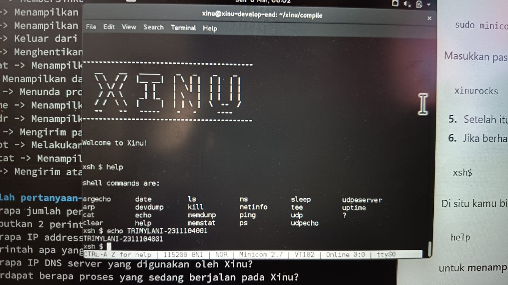

# <h1 align="center">Laporan Praktikum Modul 3   Explorasi Xinu </h1>

Tri Mylani - 2311104001

## Jalankan Xinu OS, kemudian eksekusi perintah-perintah yang tersedia pada Shell Xinu. Selanjutnya, uraikan serta jelaskan fungsi dari setiap perintah yang terdapat di dalam Xinu! 
    Perintah “help” => untuk menampilkan semua perintah pada Xinu

1. argecho → Menampilkan kembali argumen atau parameter yang diberikan pada perintah tersebut. Biasanya digunakan untuk melihat bagaimana Xinu membaca parameter input.
2. arp → Menampilkan tabel ARP (Address Resolution Protocol) yang berisi pasangan alamat IP dan alamat MAC pada jaringan.
3. cat → Menampilkan isi dari sebuah file ke layar terminal.
4. clear → Membersihkan tampilan layar terminal agar lebih rapi.
5. date → Menampilkan tanggal dan waktu yang sedang digunakan oleh sistem.
6. devdump → Menampilkan informasi mengenai perangkat (device) yang terdaftar atau digunakan oleh sistem Xinu.
7. echo → Menampilkan kembali teks atau pesan yang dimasukkan oleh pengguna pada terminal.
8. help → Menampilkan daftar seluruh perintah yang tersedia pada Xinu shell.
9. ls → Menampilkan daftar file atau direktori yang terdapat pada sistem.
10. kill → Menghentikan proses tertentu berdasarkan PID (Process ID).
11. memdump → Menampilkan isi memori sistem dalam bentuk dump untuk melihat data yang tersimpan pada memori.
12. memstat → Menampilkan status penggunaan memori pada sistem, seperti memori yang digunakan dan yang masih tersedia.
13. ns → Digunakan untuk melakukan query atau pencarian informasi pada name server dalam jaringan.
14. netinfo → Menampilkan informasi konfigurasi jaringan pada sistem Xinu.
15. ping → Mengirim paket ICMP ke alamat IP tertentu untuk menguji koneksi jaringan.
16. ps → Menampilkan daftar proses yang sedang berjalan pada sistem Xinu beserta informasi seperti PID, prioritas, dan status proses.
17. sleep → Menunda eksekusi proses selama beberapa detik sesuai dengan waktu yang diberikan.
18. tee → Menyimpan output dari suatu perintah ke dalam file sekaligus menampilkannya pada layar.
19. udp → Digunakan untuk mengirim atau menerima paket data menggunakan protokol UDP (User Datagram Protocol).
20. udpecho → Digunakan untuk mengirim dan menerima pesan UDP yang kemudian ditampilkan kembali (echo).
21. udpserver → Menjalankan server sederhana yang dapat menerima komunikasi menggunakan protokol UDP.
22. uptime → Menampilkan lama waktu sistem Xinu telah berjalan sejak terakhir kali dinyalakan (boot).
23. ? → Berfungsi sama seperti perintah help, yaitu menampilkan daftar perintah yang tersedia pada Xinu.

  
## Jawablah pertanyaan-pertanyaan berikut ini: 
    - Berapa jumlah perintah pada Xinu? 
    Jumlah perintah pada Xinu adalah 23 perintah, yaitu: argecho, arp, cat, clear, date, devdump, echo, help, ls, kill, memdump, memstat, ns, netinfo, ping, ps, sleep, tee, udp, udpecho, udpserver, uptime, dan ?.
    - Sebutkan 2 perintah yang mempunyai fungsi yang sama! 
    help dan ? Karena kedua perintah tersebut digunakan untuk menampilkan daftar semua perintah yang tersedia pada Xinu.
    - Berapa IP address Xinu?  
    IP address yang digunakan oleh Xinu biasanya adalah 192.168.1.2.
    - Perintah apa yang digunakan untuk mengetahui IP address? 
    netinfo untuk menampilkan informasi jaringan termasuk IP address pada sistem Xinu.
    - Berapa IP DNS server yang digunakan oleh Xinu? 
    IP DNS server yang digunakan oleh Xinu biasanya adalah 192.168.1.1.
    - Terdapat berapa proses yang sedang berjalan pada Xinu? 
    ps biasanya terdapat sekitar 10 proses yang sedang berjalan
    - Proses apa yang mempunyai prioritas paling rendah? 
    Proses yang mempunyai prioritas paling rendah adalah Null Process.
    - Proses apa yang mempunyai ukuran paling besar? 
    Proses yang mempunyai ukuran paling besar biasanya adalah Main Proce
    - Proses apa yang berada dalam state current? 
    Proses yang berada dalam state current biasanya adalah Main Process, karena proses tersebut sedang dijalankan oleh CPU.
    - Proses apa yang berada dalam state suspend? 
    Proses yang berada dalam state suspend biasanya adalah Shell Process.
    - Berapa PID (Process ID) dari Main process? 
    PID dari Main Process biasanya adalah 0.

## Catatan Xinu:  
    Cara keluar dari Minicom  
    1. Tekan tombol Ctrl dan A secara bersamaan. Setelah itu, lepaskan kedua tombol tersebut. Langkah berikutnya, tekan huruf X pada keyboard. Nanti akan muncul pertanyaan konfirmasi apakah ingin keluar. Pilih Yes untuk menutup Minicom. 
    2. Jika ada masalah pada Xinu (hang, dsb.) 
    3. Matikan Backend VM terlebih dahulu 
    4. Keluar dari Minicom pada development system (dapat menutup terminal langsung atau menggunakan langkah keluar dari Minicom seperti yang sudah dijelaskan sebelumnya) 
    5. Jalankan kembali Minicom pada terminal development system dengan perintah: sudo minicom 
    6. Setelah itu, nyalakan kembali Backend VM 
    7. kalo masih ga bisa coba restart development system juga

## Referensi

1. Xinu Project. (2024). Embedded Xinu Documentation. Diakses dari: https://xinu.cs.purdue.edu
2. Oracle VM VirtualBox Documentation. Oracle Corporation. https://www.virtualbox.org
3. Sourcetrail Documentation. Coati Software. https://www.sourcetrail.com
