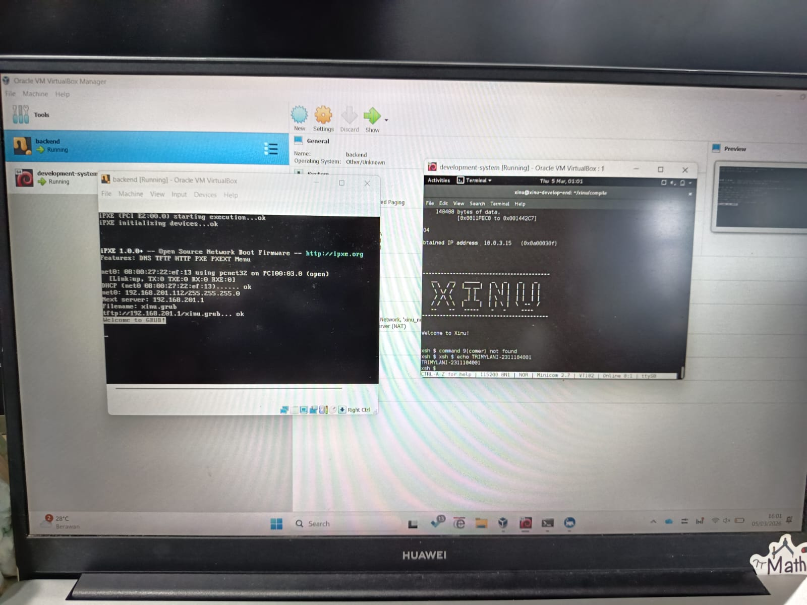

# <h1 align="center">Laporan Praktikum Modul X <-nomor modul brp y   Nama Modul</h1>

Tri Mylani - 2311104001

## Dasar Teori

Xinu (Xinu Is Not Unix) merupakan sistem operasi kecil yang digunakan sebagai media pembelajaran untuk memahami konsep dasar sistem operasi seperti manajemen proses, manajemen memori, serta komunikasi perangkat. Xinu biasanya dijalankan pada lingkungan virtual dengan menggunakan dua virtual machine, yaitu development-system VM dan backend VM. Development-system VM berfungsi sebagai tempat melakukan proses pengembangan, seperti mengedit source code, melakukan proses kompilasi, serta mengirimkan image sistem operasi. Sementara itu, backend VM berfungsi sebagai mesin yang menjalankan sistem operasi Xinu yang telah dikompilasi.

Dalam proses penggunaannya, source code Xinu harus terlebih dahulu dikompilasi menggunakan tool make. Proses kompilasi ini bertujuan untuk mengubah source code menjadi file image sistem operasi yang dapat dijalankan. Hasil dari proses tersebut berupa file bernama xinu.elf yang kemudian disalin menjadi xinu.boot pada server TFTP agar dapat diakses oleh backend VM saat proses booting berlangsung.

Backend VM melakukan proses booting melalui jaringan menggunakan protokol PXE (Preboot Execution Environment). PXE memungkinkan komputer untuk melakukan boot dengan mengambil file sistem operasi dari jaringan. Dalam proses ini, DHCP server berperan untuk memberikan alamat IP kepada backend VM, sedangkan TFTP server menyediakan file image xinu.boot yang akan diunduh oleh backend VM. Setelah file tersebut berhasil diunduh, backend VM akan memulai proses booting dan menjalankan sistem operasi Xinu.

Untuk berkomunikasi dengan Xinu yang berjalan pada backend VM digunakan aplikasi Minicom, yaitu program terminal pada sistem operasi Linux yang berfungsi untuk berinteraksi dengan serial port. Melalui Minicom, pengguna dapat memberikan berbagai perintah kepada sistem operasi Xinu dengan menggunakan prompt xsh$. Dalam proses ini juga digunakan beberapa perintah dasar Linux, seperti cd (change directory) untuk berpindah direktori, make clean untuk menghapus hasil kompilasi sebelumnya, make untuk melakukan proses kompilasi source code, serta sudo minicom untuk menjalankan Minicom dengan hak akses root. Setelah sistem berhasil berjalan, pengguna dapat mengeksplorasi berbagai perintah yang tersedia pada Xinu dengan menggunakan perintah help yang akan menampilkan daftar command yang dapat digunakan.

## Guided

1. Menjalankan Development-System VM
Jalankan aplikasi VirtualBox, kemudian start virtual machine development-system dan login menggunakan username xinu serta password xinurocks.

2. Masuk ke Direktori Compile
Pada terminal ketik perintah cd xinu/compile untuk berpindah ke direktori compile yang digunakan dalam proses kompilasi Xinu.

3. Membersihkan File Compile Lama
Ketik perintah make clean untuk menghapus hasil compile sebelumnya agar proses kompilasi dimulai dari awal.

4. Mengcompile Source Code Xinu
Ketik perintah make untuk melakukan proses compile source code sehingga menghasilkan file image xinu.elf yang kemudian disalin menjadi xinu.boot pada server TFTP.

5. Menjalankan Minicom
Jalankan perintah sudo minicom dan masukkan password xinurocks untuk membuka komunikasi serial dengan backend VM.

6. Menjalankan Backend VM
Start virtual machine backend di VirtualBox dan tunggu hingga muncul pesan “Welcome to GRUB” yang menandakan Xinu berhasil melakukan booting.

7. Berinteraksi dengan Xinu
Kembali ke terminal minicom pada development-system hingga muncul prompt xsh$ yang menandakan sistem Xinu sudah aktif.

8. Mengeksplorasi Perintah Xinu
Ketik perintah help pada prompt xsh$ untuk melihat daftar perintah yang tersedia pada Xinu shell.
   

## Referensi

1. Xinu Project. (2024). Embedded Xinu Documentation. Diakses dari: https://xinu.cs.purdue.edu
2. Oracle VM VirtualBox Documentation. Oracle Corporation. https://www.virtualbox.org
3. Sourcetrail Documentation. Coati Software. https://www.sourcetrail.com
