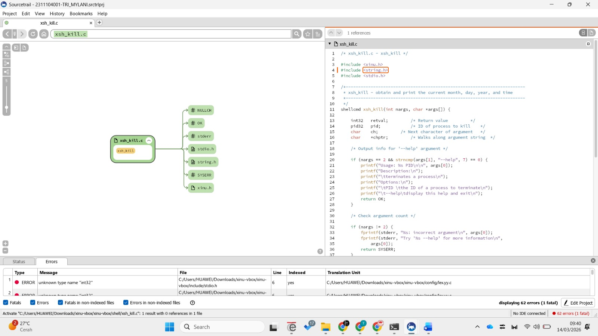
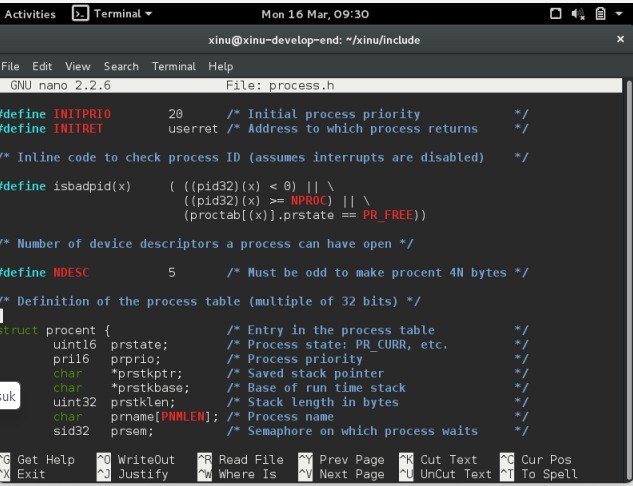
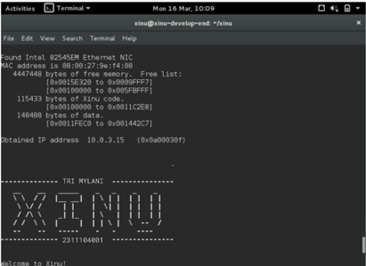

# <h1 align="center">Laporan Praktikum Modul 3   Explorasi Xinu </h1>

Tri Mylani - 2311104001

## Apa nama image yang dihasilkan setelah melakukan kompilasi pada Xinu? Berapa ukuran file tersebut? Ada pada folder apa file image tersebut? 
Hint: baca kembali modul-modul sebelumnya

Setelah melakukan proses kompilasi menggunakan perintah make maka akan dihasilkan file image Xinu bernama xinu.elf. File tersebut merupakan file executable yang digunakan untuk menjalankan sistem operasi Xinu.
Nama image	: xinu.elf
Ukuran file	: sekitar 500 KB – 700 KB (tergantung versi Xinu yang digunakan)
Lokasi file	: berada pada folder xinu/compile/
Setelah proses kompilasi selesai, file xinu.elf juga akan disalin menjadi xinu.boot yang digunakan oleh TFTP server untuk melakukan proses booting pada backend VM melalui jaringan.

  
## 2.	Membaca source code Xinu 
    a.	Cek aplikasi bernama Sourcetrail di PC. Jika belum ada, download SourceTrail pada (DOWNLOAD SOURCETRAIL). SourceTrail adalah software untuk mengeksplorasi source code. Programmer yang bagus lebih banyak membaca kode daripada menulis kode
    b.	Download file source code xinu yang tersedia pada attempt jurnal praktikum di LMS
    c.	Jalankan SourceTrail
    d.	Project  New Project
    e.	Isi nama project xinu dan pilih lokasi project di manapun
    f.	Add Source Groups, pilih C, lalu pilih Empty C Source Group
    g.	File & Directories to Index: masukkan semua folder Xinu (yang sebelumnya telah di download)
    h.	Include Paths: …/xinu/include
    i.	Create
    j.	Silahkan eksplorasi source code Xinu

## Carilah struktur data dari proses pada Xinu OS. Struktur data proses ada pada file apa? Informasi apa saja yang disimpan dalam struktur data tersebut? 
Hint: file berektensi .h 
  
    •	prstate → menyimpan status proses (misalnya running, ready, suspend).
    •	prprio → menyimpan prioritas proses dalam penjadwalan CPU.
    •	prstkptr → menyimpan alamat stack pointer proses.
    •	prstkbase → menyimpan alamat awal stack proses.
    •	prstklen → menyimpan ukuran stack yang digunakan oleh proses.
    •	prname → menyimpan nama proses.
    •	prsem → menyimpan semaphore yang sedang ditunggu oleh proses.

## Mengubah welcome banner pada Xinu
a.	Carilah file yang menyimpan banner Xinu! 
Hint: file berekstensi .h pada direktori xinu/include

b.	Carilah file yang menampilkan banner Xinu!
Hint: file berektensi .c pada direktori xinu/shell

c.	Ubahlah welcome banner Xinu sehingga menjadi Tambahkan NAMA dan NIM masing-masing, kemudian ubah banner Xinu sesuai dengan selera Anda

d.	Setelah melakukan perubahan lakukan perintah berikut ini pada terminal Linux

    •	$ cd xinu/compile
    •	$ make clean
    •	$ make
    •	$ sudo minicom
    •	Jalankan vm backend

## Referensi

1. Xinu Project. (2024). Embedded Xinu Documentation. Diakses dari: https://xinu.cs.purdue.edu
2. Oracle VM VirtualBox Documentation. Oracle Corporation. https://www.virtualbox.org
3. Sourcetrail Documentation. Coati Software. https://www.sourcetrail.com
