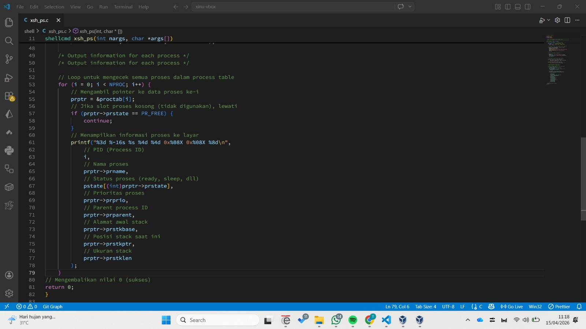
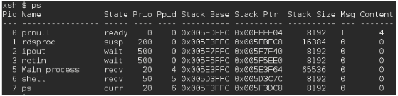
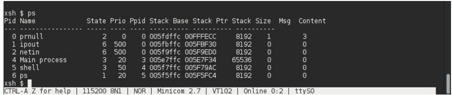
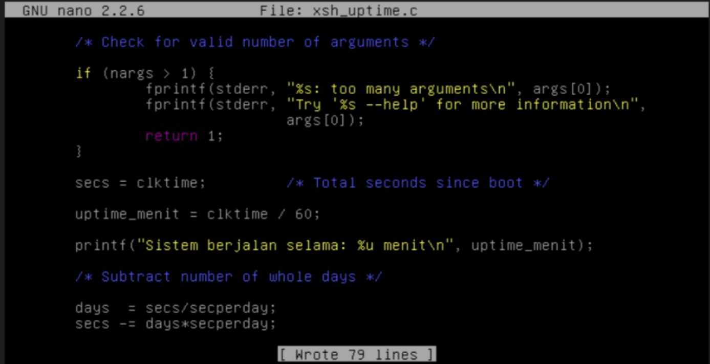

# <h1 align="center">Laporan Praktikum Modul 5   Explorasi Proses </h1>

Tri Mylani - 2311104001

## 1. Jawablah pertanyaan berikut ini: 
    a. Berapa banyaknya maksimum proses yang ada pada Xinu? 
    Jawaban: Maksimum proses ditentukan oleh konstanta NPROC pada process.h, yaitu 8 proses.
    b. Maksimal panjang nama proses? 
    Jawaban: Ditentukan oleh PNMLEN, yaitu 16 karakter.
    c. Nilai prioritas awal saat proses dibuat? 
    Jawaban: Nilai awal ditentukan oleh INITPRIO, yaitu 20.
    d. Total state pada Xinu? 
    Jawaban: Terdapat 7 state proses, yaitu:
    PR_FREE
    PR_CURR
    PR_READY
    PR_RECV
    PR_SLEEP
    PR_SUSP
    PR_WAIT
    PR_RECTIM (tambahan untuk receive dengan timeout)

  
## 2.	Perintah ps adalah perintah untuk menampilkan statistik process yang berjalan. Source code dari ps tersimpan pada file xsh_ps.c. Carilah file tersebut dan beri komentar pada 20 baris terakhir di source code tersebut!
    

## 3. Ubahlah perintah ps (source code: xsh_ps.c) pada Xinu sehingga menampilkan informasi tambahan berupa kolom yang berisi total message yang ada pada proses seperti gambar di bawah ini: 
Hint: file berektensi .h 

## 4. Ubahlah perintah uptime pada Xinu sehingga menampilkan lamanya Xinu
sejak booting hanya dalam satuan menit.

## Referensi

1. Xinu Project. (2024). Embedded Xinu Documentation. Diakses dari: https://xinu.cs.purdue.edu
2. Oracle VM VirtualBox Documentation. Oracle Corporation. https://www.virtualbox.org
3. Sourcetrail Documentation. Coati Software. https://www.sourcetrail.com
