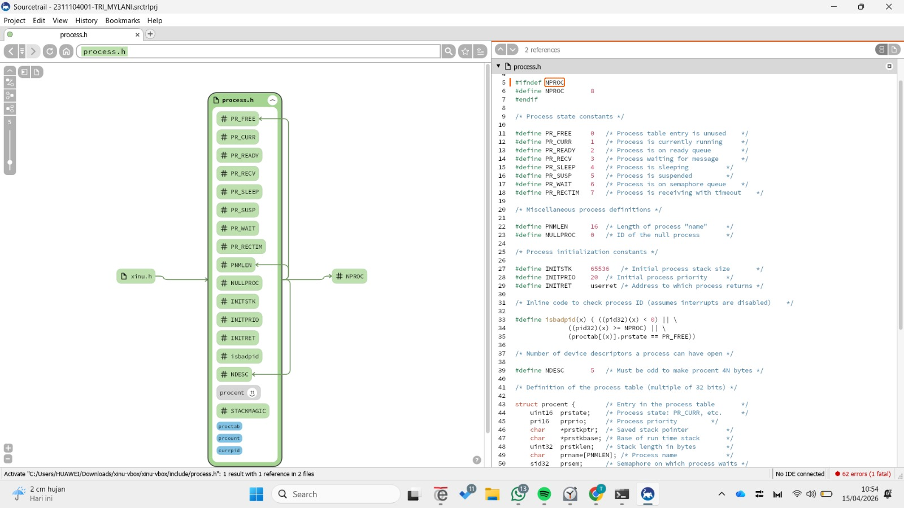

# <h1 align="center">Laporan Praktikum Modul 4  Eksplorasi Proses</h1>

Tri Mylani - 2311104001

## Dasar Teori
Eksplorasi proses membahas bagaimana sistem operasi mengelola proses yang sedang berjalan. Proses table merupakan struktur data yang digunakan oleh sistem operasi untuk menyimpan seluruh informasi mengenai proses yang aktif. Setiap proses direpresentasikan sebagai sebuah entri dalam process table. Ketika suatu proses dibuat, maka entri baru akan ditambahkan ke dalam tabel tersebut, dan ketika proses dihentikan (terminasi), entri tersebut akan dihapus.

Dalam implementasinya pada XINU, terdapat beberapa file yang berkaitan dengan pengelolaan proses. File ./include/process.h digunakan untuk konfigurasi setiap proses, sedangkan ./system/create.c berfungsi untuk membuat proses baru. Selain itu, ./system/kill.c digunakan untuk melakukan terminasi proses, dan ./system/resume.c digunakan untuk melanjutkan kembali proses yang sempat dihentikan.

Process table pada XINU menggunakan global array bernama proctab[] yang dapat ditemukan dalam file ./include/process.h. Isi dari array ini adalah PCB (Process Control Block) yang direpresentasikan sebagai struktur procent. XINU menggunakan struktur data implisit, sehingga tidak secara eksplisit membuat ID sebagai entri dalam struct procent. Sebagai contoh, akses seperti proctab[3] secara langsung merujuk pada proses dengan PID 3.

## Guided
1. Buka Sourcetrail
2. Open project (.srctrlprj) atau buat project baru
3. Tunggu proses indexing
4. Ketik process.h di search bar
5. Klik hasilnya
6. Lihat diagram (tengah) dan kode (kanan)

## Referensi

1. Xinu Project. (2024). Embedded Xinu Documentation. Diakses dari: https://xinu.cs.purdue.edu
2. Oracle VM VirtualBox Documentation. Oracle Corporation. https://www.virtualbox.org
3. Sourcetrail Documentation. Coati Software. https://www.sourcetrail.com
