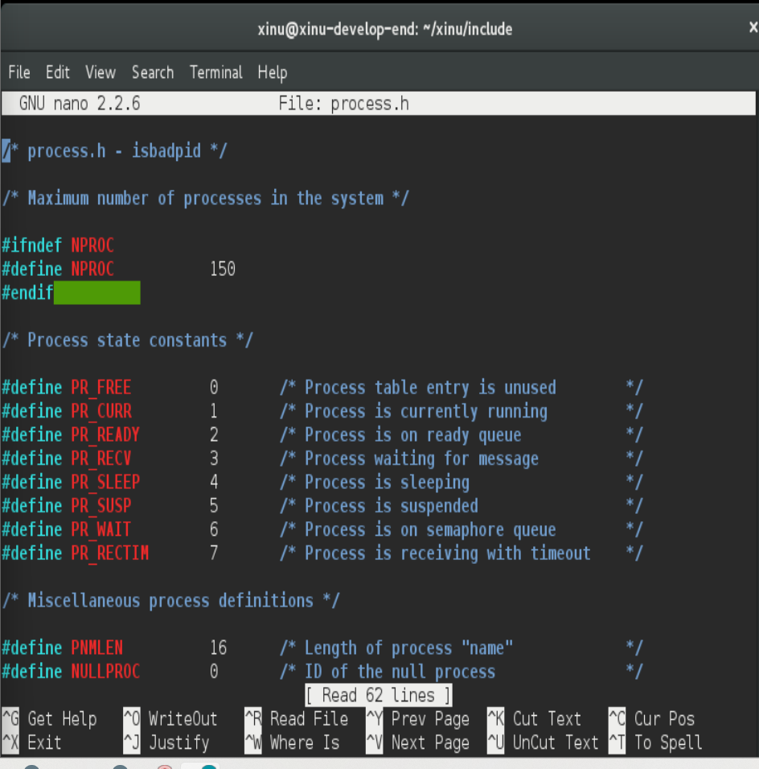
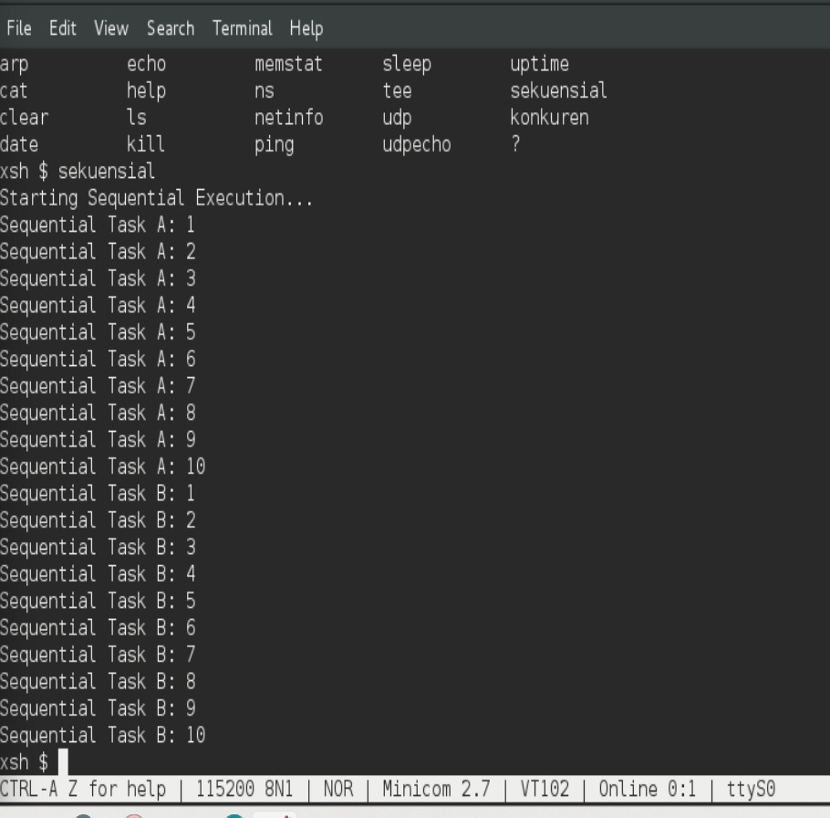
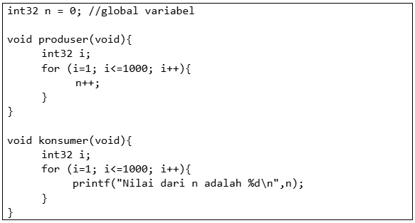
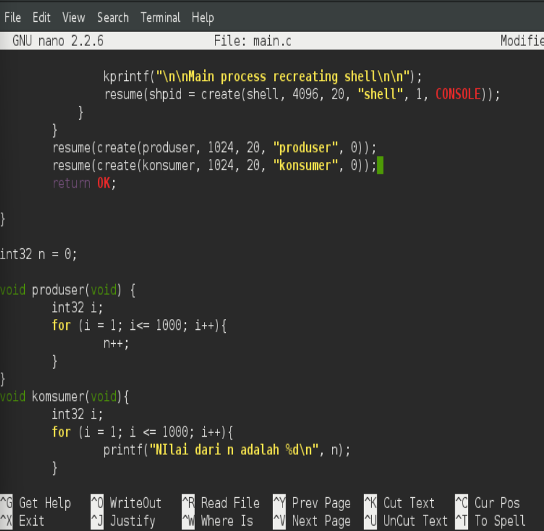
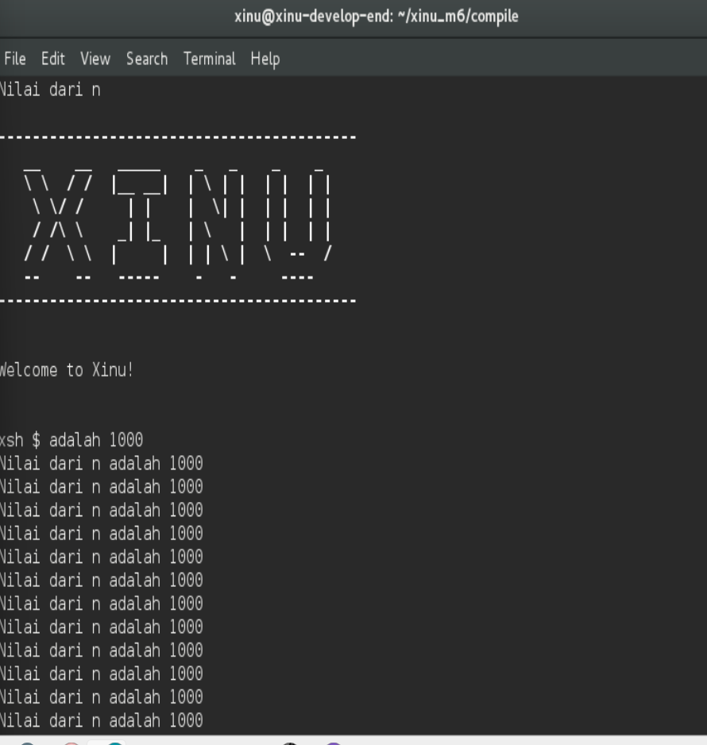

# <h1 align="center">Laporan Praktikum Modul 5   Explorasi Proses </h1>

Tri Mylani - 2311104001

## 1. Selain hardware (memory), batasan maksimal proses dapat ditentukan dengan secara software.  Pada Linux maksimal proses adalah 4194303 proses (64 bit) dan 32767 proses (32 bit) dapat dilihat melalui perintah $cat /proc/sys/kernel/pid_max 

Carilah pada source code Xinu yang memberi batasan mengenai banyaknya proses yang bisa dibuat! Berapa maksimal proses dalam Xinu?  Ubah menjadi maksimal 150 proses! 

## 2.	Jalankan kode sekuensial
    

## 3.  Jalankan kode konkuren! 

## 4. Buatlah 2 proses produser dan konsumer. Produser memproduksi angka integer dari 1-1000. Konsumer mengkonsumsi integer yang diproduksi oleh produser dan menampilkannya! (Gunakan variabel global bertipe int32 bernama n yang digunakan secara bersama oleh kedua proses)

Hasil dari program ini cukup mengejutkan (tidak akan sesuai dengan intuisi awal). Jelaskan mengapa hasilnya seperti itu!

## Referensi

1. Xinu Project. (2024). Embedded Xinu Documentation. Diakses dari: https://xinu.cs.purdue.edu
2. Oracle VM VirtualBox Documentation. Oracle Corporation. https://www.virtualbox.org
3. Sourcetrail Documentation. Coati Software. https://www.sourcetrail.com
