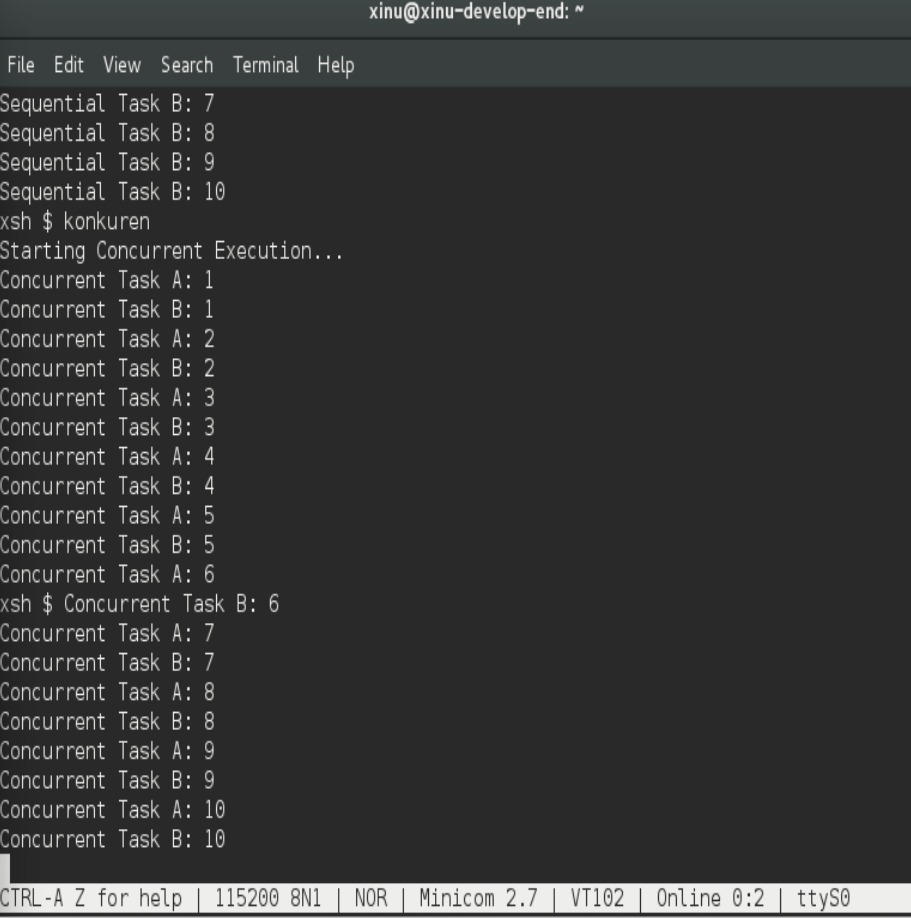

# <h1 align="center">Laporan Praktikum Modul 6  Sekuensial dan Konkuren</h1>

Tri Mylani - 2311104001

## Dasar Teori
    Eksekusi sekuensial adalah cara menjalankan proses atau instruksi secara berurutan, di mana suatu proses harus menunggu proses sebelumnya selesai sebelum dapat dijalankan. Pada model ini, hanya ada satu alur eksekusi dalam satu waktu. Pendekatan sekuensial relatif sederhana dan mudah dipahami karena tidak melibatkan interaksi antar proses secara bersamaan. Namun, kelemahannya adalah kurang efisien dalam pemanfaatan sumber daya, terutama pada sistem yang memiliki kemampuan multitasking.

    Sebaliknya, eksekusi konkuren memungkinkan beberapa proses berjalan secara bersamaan dalam rentang waktu yang sama. Pada sistem dengan satu prosesor, konkuren dicapai melalui teknik context switching, yaitu perpindahan cepat antar proses sehingga seolah-olah berjalan bersamaan. Sementara itu, pada sistem multiprosesor, beberapa proses benar-benar dapat dieksekusi secara paralel. Eksekusi konkuren meningkatkan efisiensi penggunaan CPU dan responsivitas sistem, tetapi juga menimbulkan tantangan seperti sinkronisasi, race condition, dan deadlock.

## Guided
    Program Sekuensial (Sequential)
    1. Buka sistem development XINU dan masuk ke direktori project
    2. Buat atau edit program (misalnya di main.c atau file baru)
    3. Tuliskan beberapa perintah yang dijalankan berurutan (tanpa create() dan resume())
    4. Simpan program
    5. Masuk ke folder compile
    6. Jalankan perintah:
        make clean
        make
    7. Jalankan backend XINU
    8. Amati hasil output yang tampil secara berurutan

    

    Program Konkuren (Concurrent)
    1. Buka sistem development XINU
    2. Buat atau edit program proses (misalnya di main.c)
    3. Tambahkan fungsi proses (misalnya void prosesA() dan void prosesB())
    4. Gunakan:
    create() → untuk membuat proses
    resume() → untuk menjalankan proses
    5. Simpan program
    6. Masuk ke folder compile
    7. Jalankan:
        make clean
        make
    8. Jalankan backend XINU
    9. Amati output yang berjalan bergantian / seolah bersamaan

## Referensi

1. Xinu Project. (2024). Embedded Xinu Documentation. Diakses dari: https://xinu.cs.purdue.edu
2. Oracle VM VirtualBox Documentation. Oracle Corporation. https://www.virtualbox.org
3. Sourcetrail Documentation. Coati Software. https://www.sourcetrail.com
