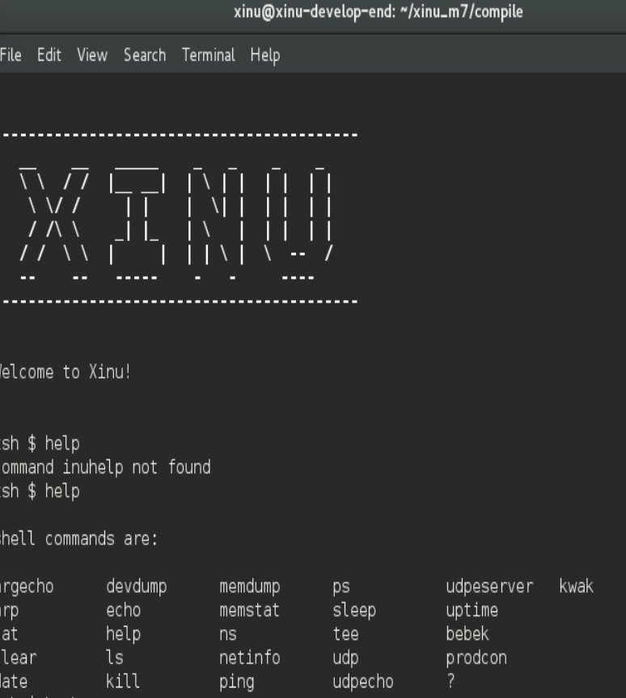
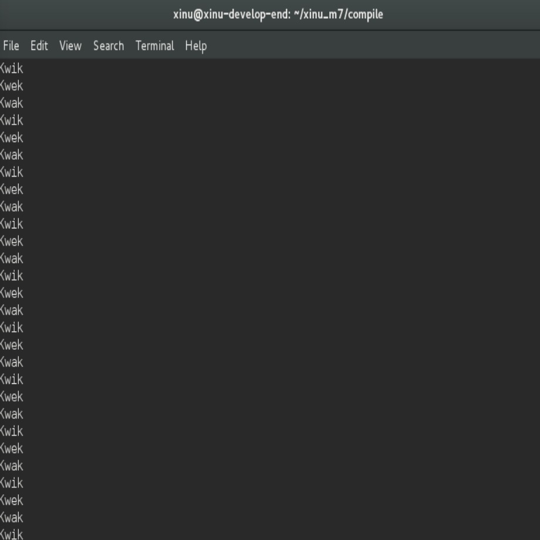
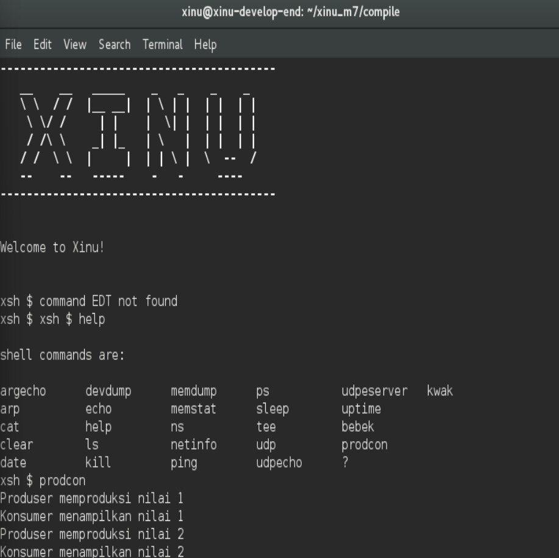
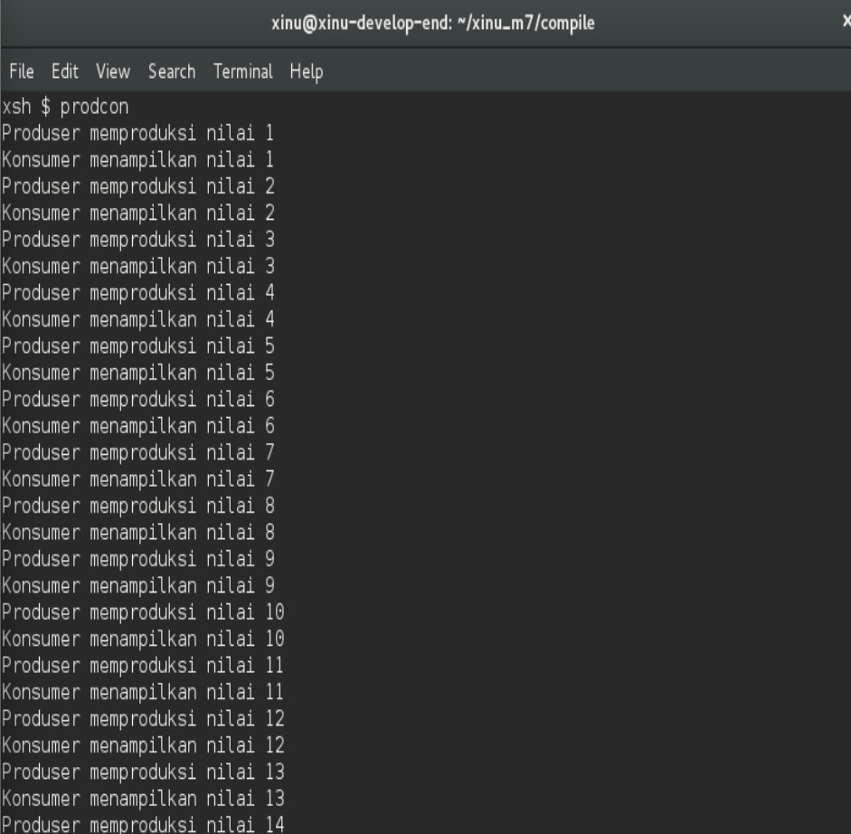

# <h1 align="center">Laporan Praktikum Modul 5   Explorasi Proses </h1>

Tri Mylani - 2311104001

## 1. SBuatlah 3 buah proses yaitu P1, P2 dan P3. P1 selalu menampilkan “kwak”, P2 selalu menampilkan “kwik”, P3 selalu menampilkan “kwek”. Menggunakan 3 proses tersebut dan beberapa buah semaphore, buatlah program yang dapat menampilkan:

Kwak
Kwik
Kwek
Kwak
Kwik
Kwek
…

## 2. Buatlah proses bernama produser yang memproduksi bilangan 1-1000. Buatlah proses bernama konsumer yang akan menampilkan nilai yang diproduksi oleh produser. Gunakan semaphore!

Produser memproduksi nilai 1
Konsumer menampilkan nilai 1
Produser memproduksi nilai 2
Konsumer menampilkan nilai 2
….
Produser memproduksi nilai 1000
Konsumer menampilkan nilai 1000

Catatan: harus menggunakan semaphore, proses konkuren, tidak boleh hanya 1 proses dan hanya menggunakan while loop kemudian print.

## Referensi

1. Xinu Project. (2024). Embedded Xinu Documentation. Diakses dari: https://xinu.cs.purdue.edu
2. Oracle VM VirtualBox Documentation. Oracle Corporation. https://www.virtualbox.org
3. Sourcetrail Documentation. Coati Software. https://www.sourcetrail.com
