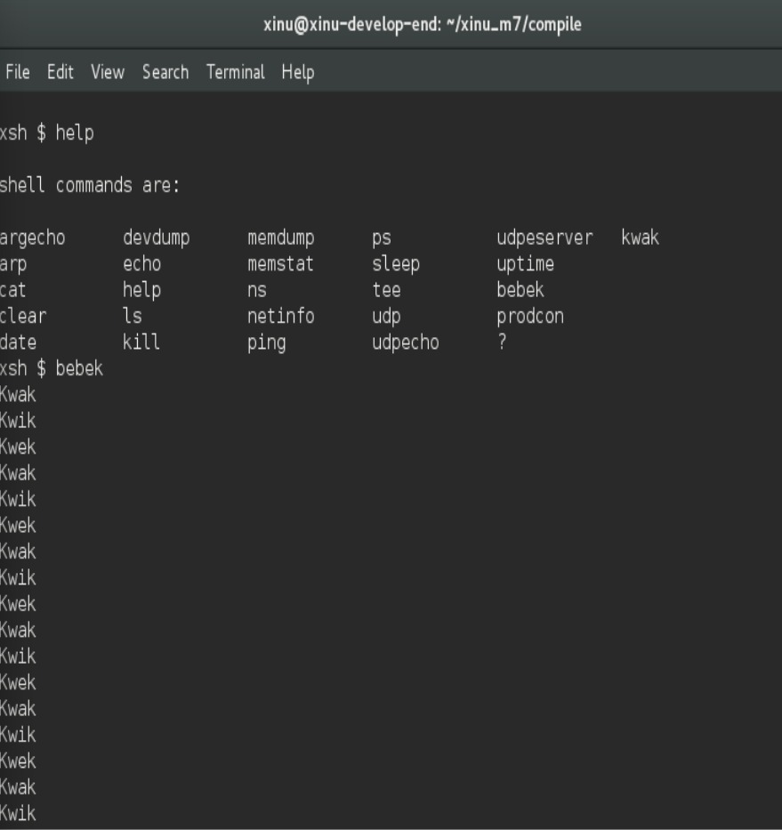

# <h1 align="center">Laporan Praktikum Modul 6  Sekuensial dan Konkuren</h1>

Tri Mylani - 2311104001

## Dasar Teori
    Semaphore merupakan salah satu mekanisme sinkronisasi dalam sistem operasi yang digunakan untuk mengatur akses beberapa proses terhadap sumber daya bersama agar tidak terjadi konflik atau race condition. Konsep semaphore pertama kali diperkenalkan oleh Edsger W. Dijkstra sebagai solusi untuk permasalahan konkurensi pada sistem multiprogramming. Dengan adanya semaphore, proses-proses yang berjalan secara bersamaan dapat diatur sehingga tidak saling mengganggu ketika mengakses data atau resource yang sama.

    Tujuan utama penggunaan semaphore adalah untuk menghindari terjadinya race condition, mengatur sinkronisasi antar proses, serta mengontrol akses ke bagian kritis (critical section), yaitu bagian program yang mengakses data bersama. Tanpa mekanisme pengaturan, beberapa proses dapat mengakses dan memodifikasi data yang sama secara bersamaan sehingga menyebabkan inkonsistensi data. Oleh karena itu, semaphore digunakan untuk memastikan bahwa hanya satu proses atau sejumlah proses tertentu saja yang dapat mengakses resource pada waktu tertentu.

## Guided
    Program Sekuensial (Sequential)
    1. Inisialisasi variabel data dan semaphore (empty, full)
    2. Set empty = 1, full = 0
    3. Buat proses produser (loop 1–1000)
    wait(empty) → isi data → print → signal(full)
    4. Buat proses konsumer (loop 1–1000)
    wait(full) → ambil data → print → signal(empty)
    5. Jalankan kedua proses dengan create() & resume()
    6. Compile (make clean, make)
    7. Jalankan di Xinu (prodcon)

## Referensi

1. Xinu Project. (2024). Embedded Xinu Documentation. Diakses dari: https://xinu.cs.purdue.edu
2. Oracle VM VirtualBox Documentation. Oracle Corporation. https://www.virtualbox.org
3. Sourcetrail Documentation. Coati Software. https://www.sourcetrail.com
