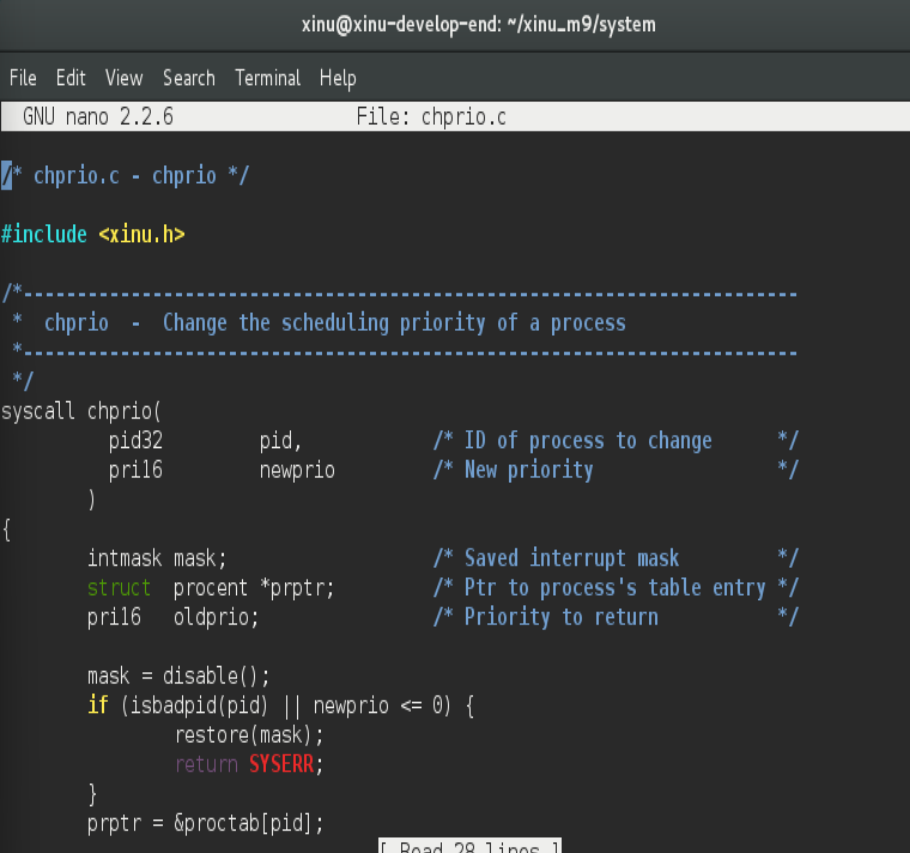
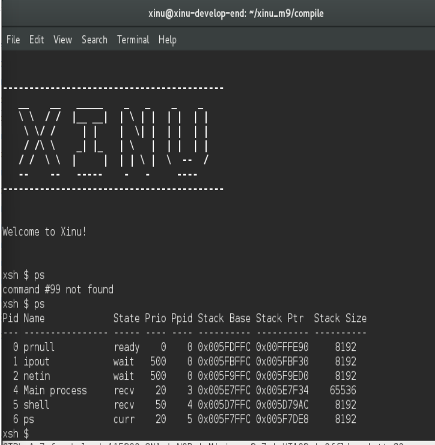
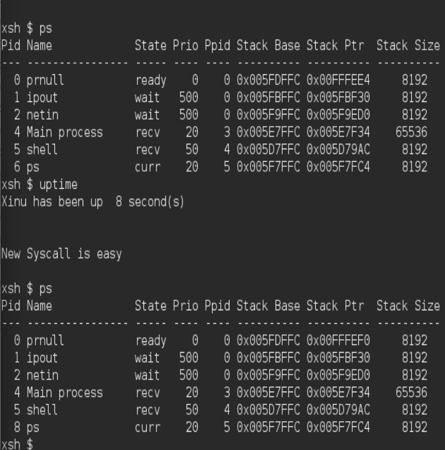
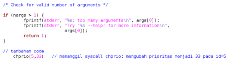
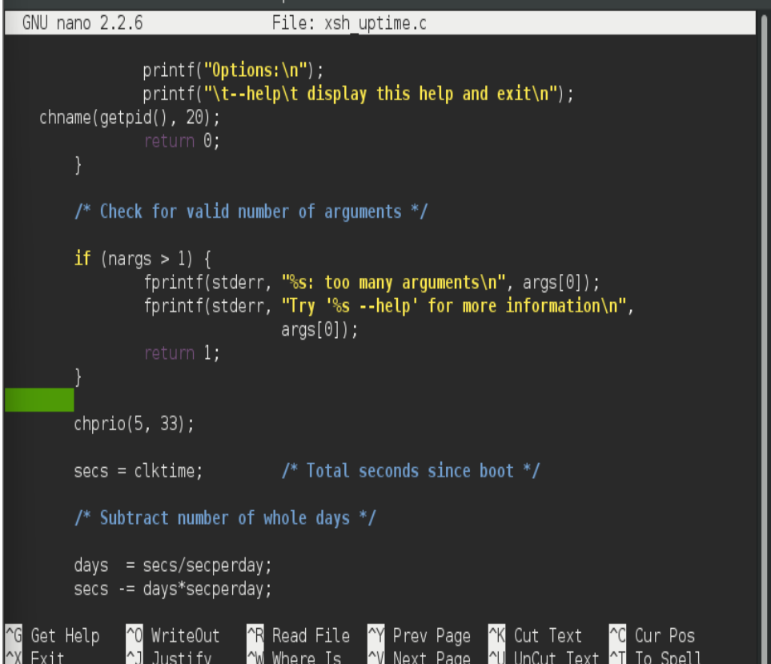
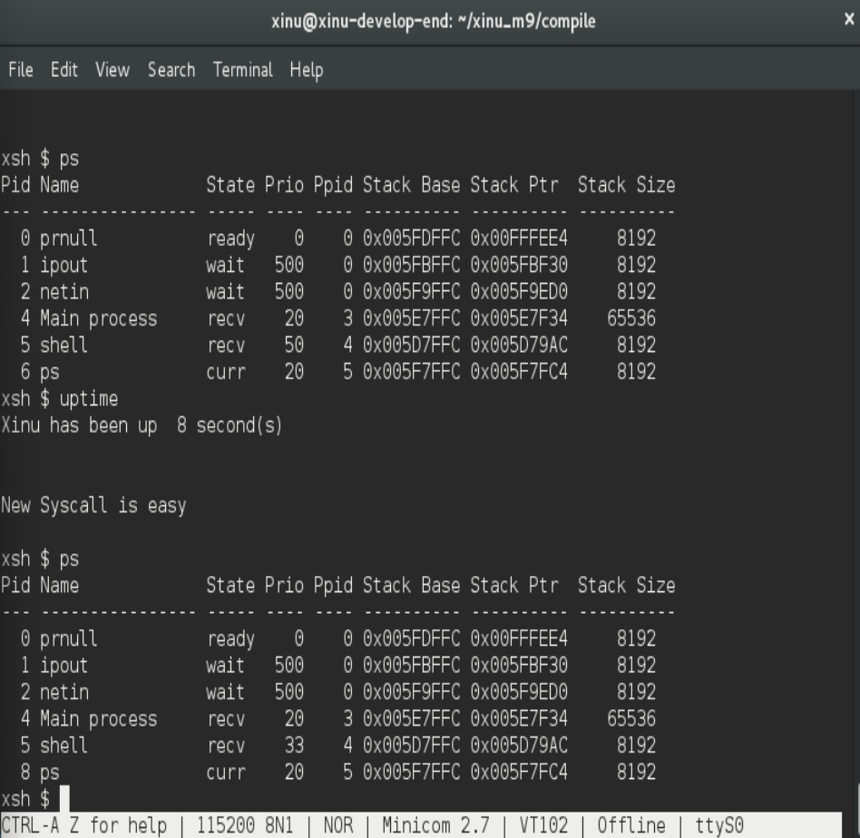
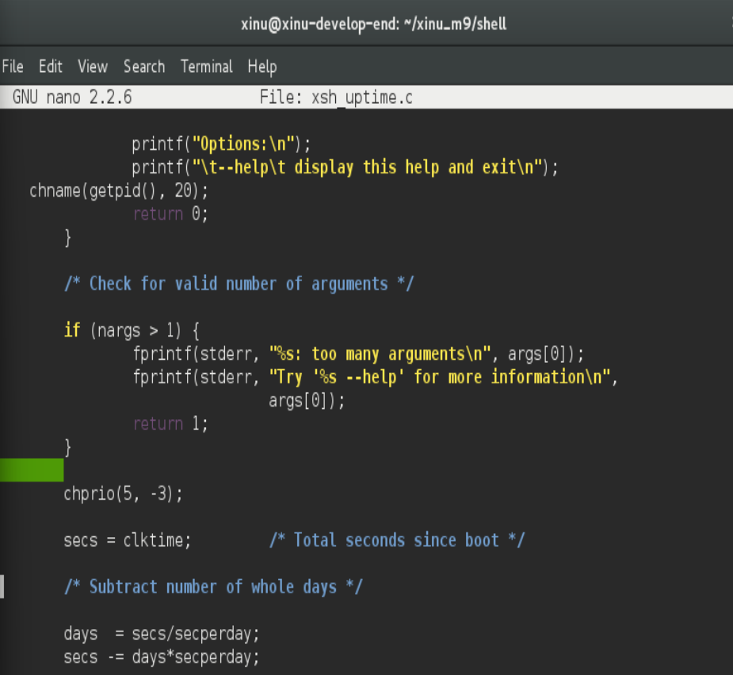
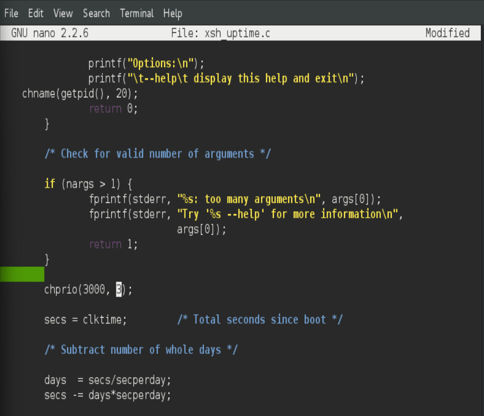
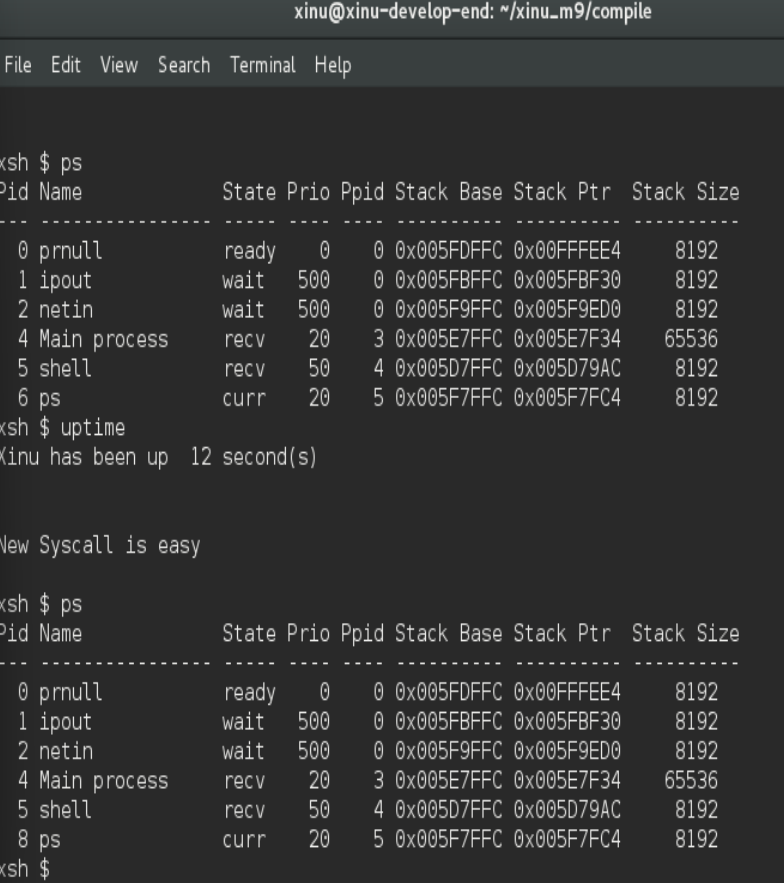

# <h1 align="center">Laporan Praktikum Modul 9   Syscall Xinu </h1>

Tri Mylani - 2311104001

## 1. Buat syscall baru seperti yang ditunjukkan pada modul syscall poin 9.5! (sertakan Screenshot kode dan hasil run)

…

## 2. BPerbaiki syscall chprio (xinu/system/chprio.c) dengan memperhatikan validasi input 
    1. Pastikan id adalah angka dari 0 – NPROC (ukuran maks banyaknya proses)
    2. Pastikan prioritas adalah bilangan yang positif

Compile dan jalankan Xinu dengan syscall yang telah diperbaiki
make clean dan make

## 3. Lakukan hal-hal berikut ini
    1. Edit xsh_uptime.c
    Tambahkan kode berikut

    2. Compile source code tersebut dengan perintah
    make clean
    make
    3. Jalankan perintah ps
    xsh $ ps
    4. perhatikan prioritas proses dengan id = 5 
    5. Jalankan uptime 
    xsh $ uptime
    6. Perhatikan hasil perintah tersebut
    7. Jalankan ps
    xsh $ ps
    perhatikan prioritas proses dengan id = 5 seharusnya sudah berubah

## 4. Testing chprio syscall yang telah diubah
    1. Testing prioritas tidak boleh < 0: Ubah “chprio(5,33)” menjadi “chprio(5,-3)” pada xsh_uptime.c

    2. Testing id adalah valid: Ubah “chprio(5,33)” menjadi “chprio(3000,3)”

    3. Hasil dua testing di atas adalah prioritas tidak berubah karena salah argument (dibuktikan dengan menggunakan perintah ps)

## Referensi

1. Xinu Project. (2024). Embedded Xinu Documentation. Diakses dari: https://xinu.cs.purdue.edu
2. Oracle VM VirtualBox Documentation. Oracle Corporation. https://www.virtualbox.org
3. Sourcetrail Documentation. Coati Software. https://www.sourcetrail.com
