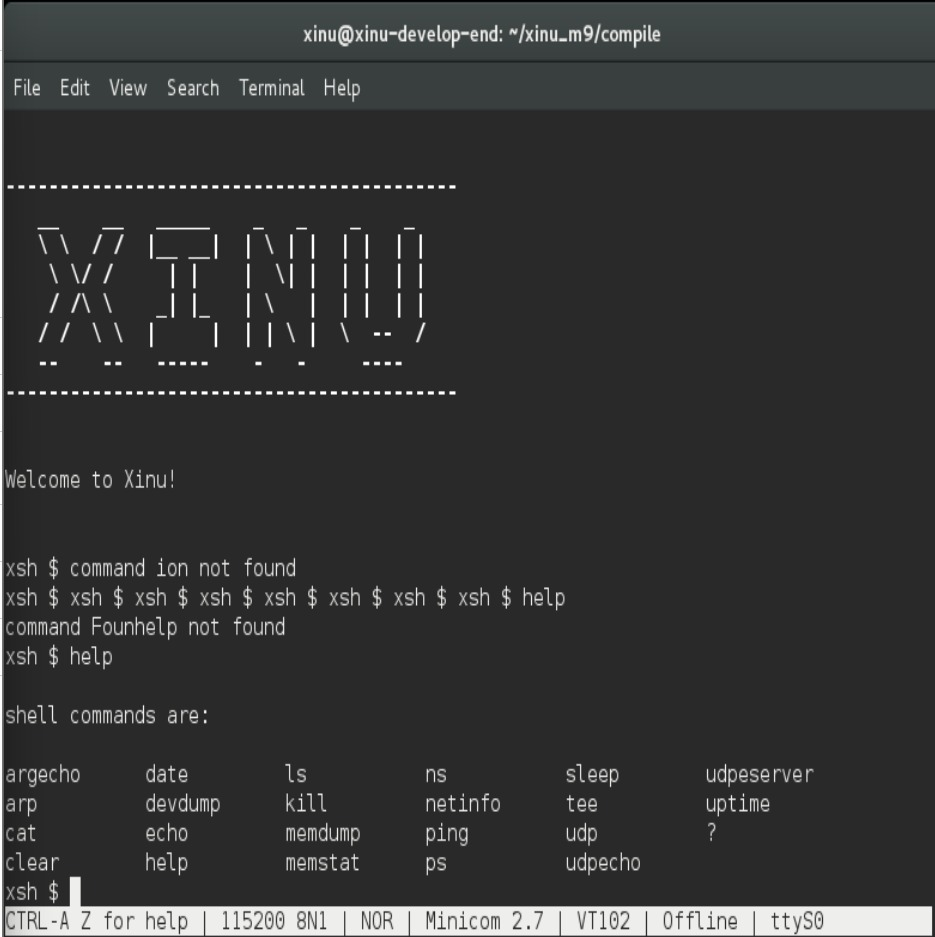

# <h1 align="center">Laporan Praktikum Modul 9  Syscall</h1>

Tri Mylani - 2311104001

## Dasar Teori

    System call (syscall) merupakan mekanisme yang digunakan oleh program user untuk meminta layanan dari kernel pada sistem operasi. Dalam arsitektur sistem operasi modern, terdapat pemisahan antara user mode dan kernel mode untuk menjaga keamanan dan stabilitas sistem. Program aplikasi yang berjalan di user mode tidak diperbolehkan mengakses perangkat keras atau sumber daya sistem secara langsung, sehingga diperlukan system call sebagai jembatan komunikasi antara user dan kernel.

    System call bekerja dengan cara mengalihkan eksekusi dari user mode ke kernel mode melalui interrupt atau trap khusus. Ketika sebuah program memanggil syscall, sistem operasi akan memverifikasi permintaan tersebut, kemudian mengeksekusi fungsi yang sesuai di kernel. Setelah selesai, kontrol dikembalikan ke program user beserta hasilnya. Mekanisme ini memastikan bahwa semua akses ke sumber daya penting seperti CPU, memori, dan perangkat I/O tetap terkontrol.

## Guided

    1. ls
    2. wget agha.work/modul9.sh
    3. cat modul9.sh
    4. chmod +x modul9.sh
    5. ls
    6. ./modul9.sh
    7. ls
    8. cd xinu_m9/compile/
    9. make clean
    10. make
    11. sudo minicom
    12. history

## Referensi

1. Xinu Project. (2024). Embedded Xinu Documentation. Diakses dari: https://xinu.cs.purdue.edu
2. Oracle VM VirtualBox Documentation. Oracle Corporation. https://www.virtualbox.org
3. Sourcetrail Documentation. Coati Software. https://www.sourcetrail.com
