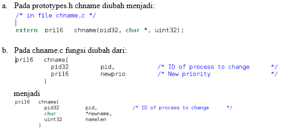
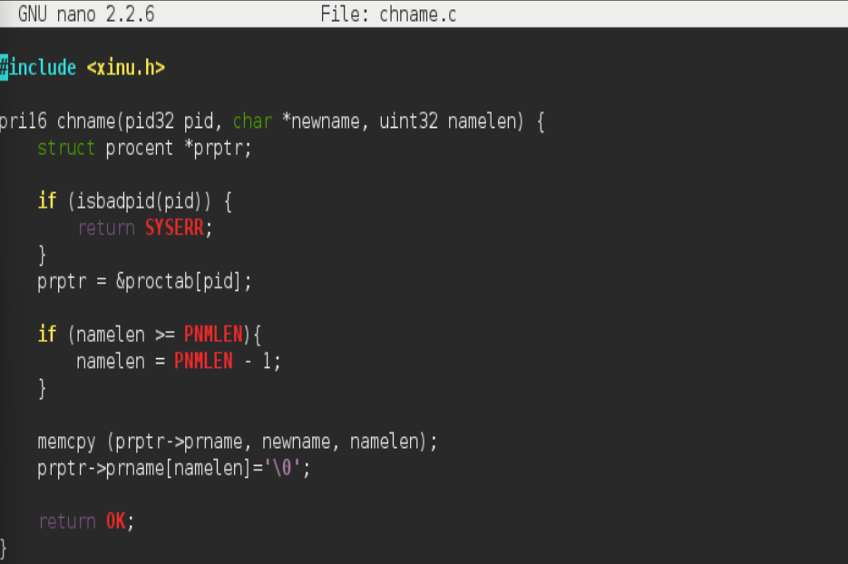
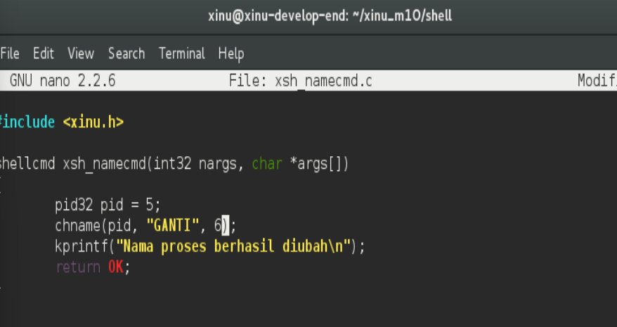
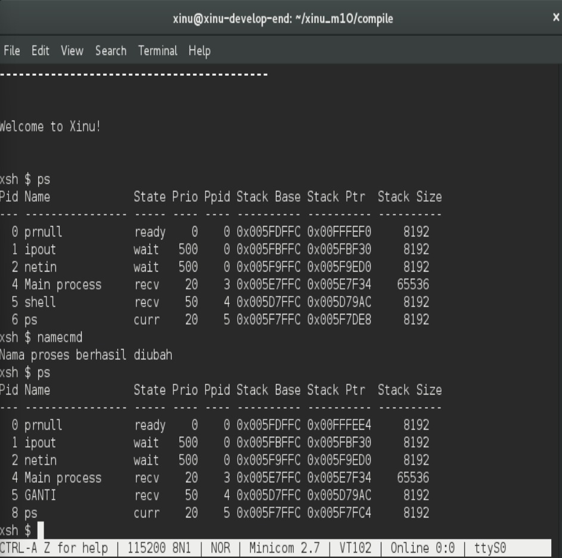
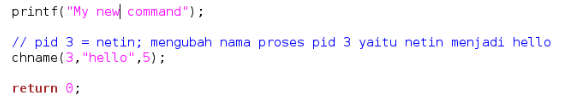
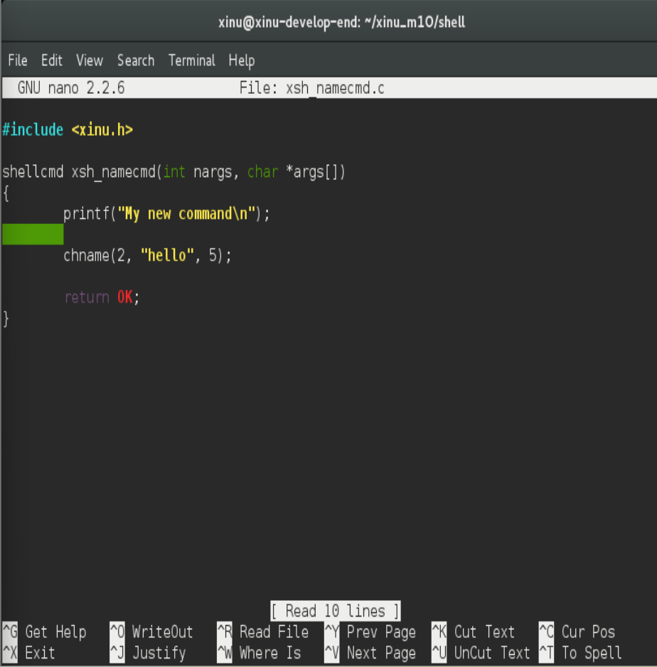
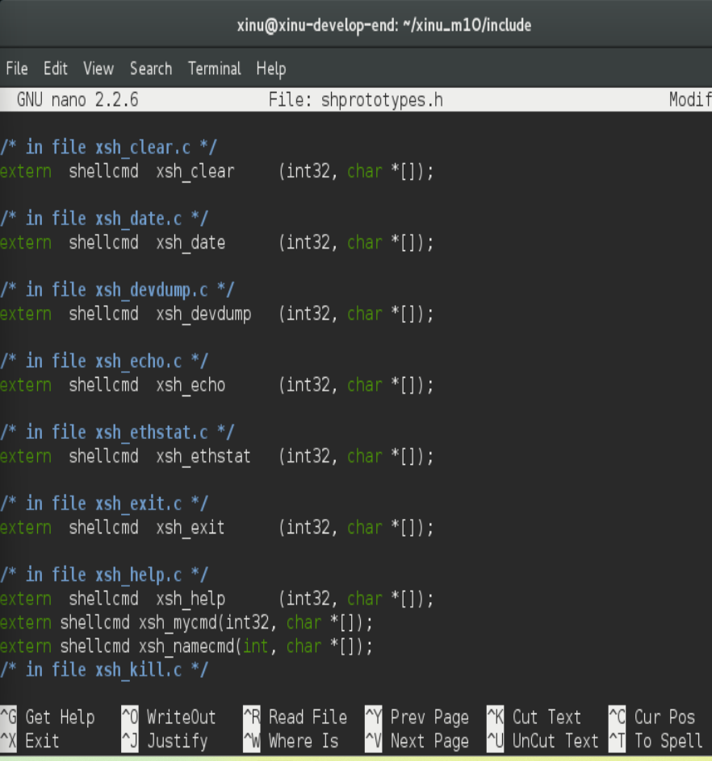
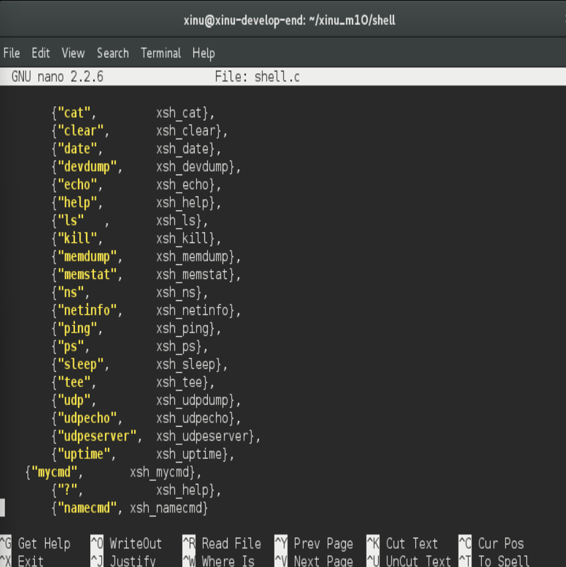
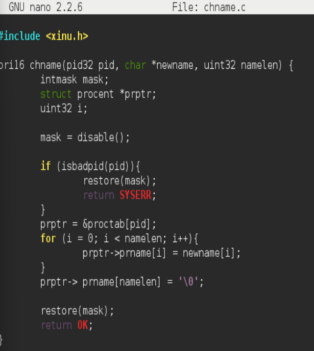
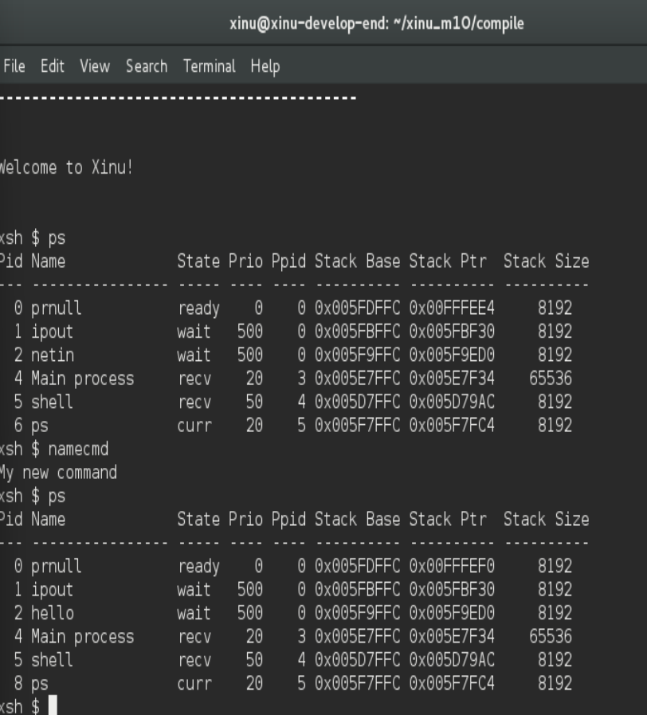

# <h1 align="center">Laporan Praktikum Modul 10   Syscall Xinu </h1>

Tri Mylani - 2311104001

## 1. Akan dimodifikasi shell dengan modifikasi syscall bernama chname yang berfungsi untuk mengubah nama suatu proses. Lihat kembali modul sebelumnya cara membuat syscall. 

## 2. Buatlah perintah baru bernama namecmd sesuai dengan langkah-langkah pada no.5 pada modul shell! Berikut adalah kode dalam perintah baru namecmd: 

## 3.  Test hasilnya: 
        a. Masuk ke terminal xinu
        b. Jalankan perintah ps
        c. Jalankan perintah namecmd
        c. Jalankan perintah ps
        e. Lihat nama proses telah berubah

## Referensi

1. Xinu Project. (2024). Embedded Xinu Documentation. Diakses dari: https://xinu.cs.purdue.edu
2. Oracle VM VirtualBox Documentation. Oracle Corporation. https://www.virtualbox.org
3. Sourcetrail Documentation. Coati Software. https://www.sourcetrail.com
