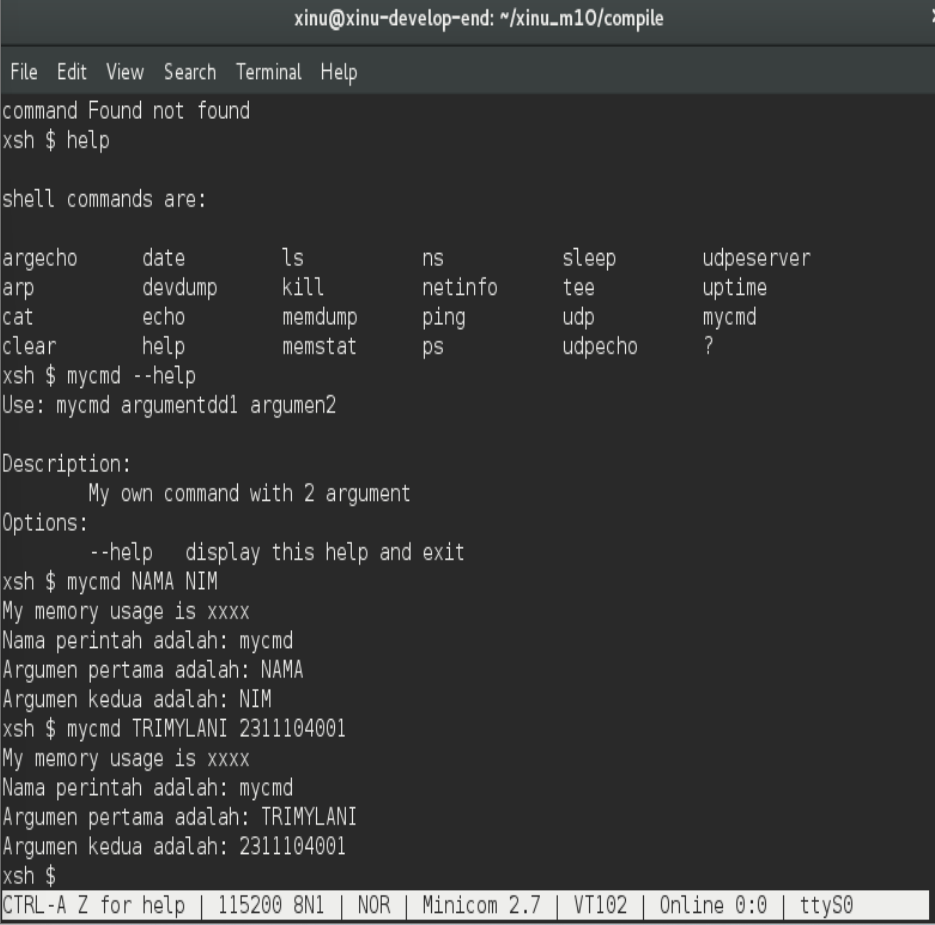

# <h1 align="center">Laporan Praktikum Modul 10  Shell</h1>

Tri Mylani - 2311104001

## Dasar Teori

    Shell dalam sistem operasi merupakan antarmuka yang menghubungkan pengguna dengan kernel. Melalui shell, pengguna dapat memberikan perintah untuk menjalankan program, mengelola proses, serta mengakses berbagai fungsi sistem. Shell bekerja dengan cara membaca input dari pengguna, kemudian menerjemahkannya menjadi instruksi yang dapat dipahami oleh kernel. Dalam sistem seperti Xinu, shell biasanya berbasis teks (command-line interface) dan menyediakan berbagai perintah bawaan seperti melihat proses, menjalankan program, dan mengelola sistem.

    Selain sebagai penerjemah perintah, shell juga berperan dalam pengelolaan eksekusi program dan penambahan fitur baru. Pengguna dapat menambahkan perintah baru dengan membuat fungsi tertentu (misalnya xsh_namacmd) dan mendaftarkannya ke dalam tabel perintah (command table). Hal ini membuat shell menjadi fleksibel dan dapat dikembangkan sesuai kebutuhan. Dengan adanya shell, interaksi dengan sistem operasi menjadi lebih terstruktur, mudah digunakan, dan mendukung pengelolaan proses secara lebih efisien.

## Guided

    1. ls
    2. wget agha.work/modul10.sh
    3. ls
    4. chmod +x modul10.sh
    5. ls
    6. ./modul10.sh
    7. ls
    8. cd xinu_m10/compile/
    9. make clean
    10. make
    11. sudo minicom
    12. history

## Referensi

1. Xinu Project. (2024). Embedded Xinu Documentation. Diakses dari: https://xinu.cs.purdue.edu
2. Oracle VM VirtualBox Documentation. Oracle Corporation. https://www.virtualbox.org
3. Sourcetrail Documentation. Coati Software. https://www.sourcetrail.com
