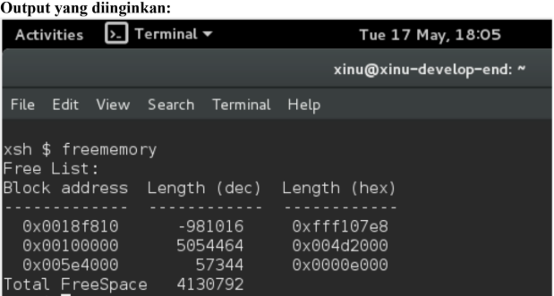
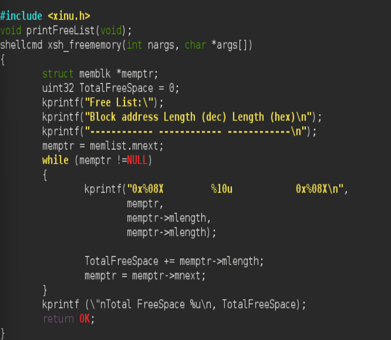
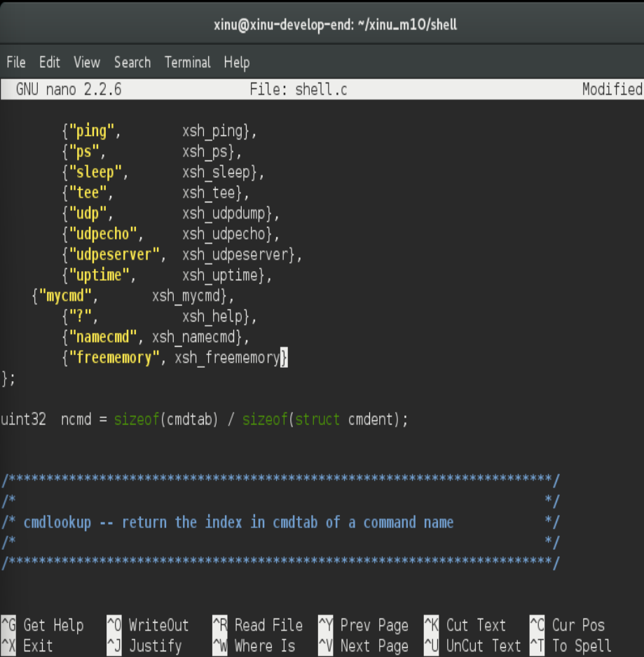
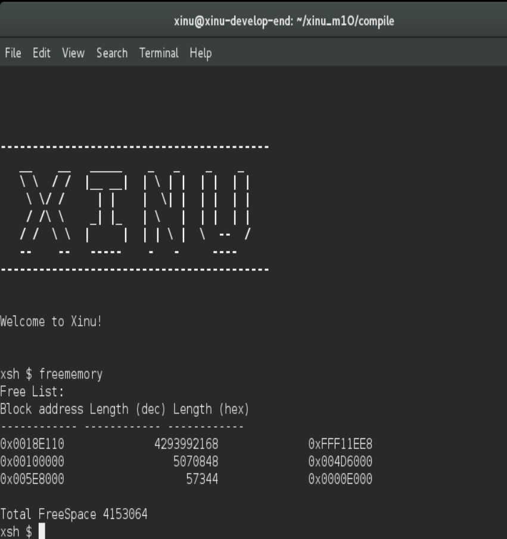

# <h1 align="center">Laporan Praktikum Modul 11   Memory Xinu </h1>

Tri Mylani - 2311104001

## 1. Buatlah perintah baru bernama freememory yang memiliki dua fungsi berikut: 
### a. [40 poin] Menampilkan seluruh free memory block yang tercatat dalam free memory list pada Xinu. 
### b. [40 poin] Menghitung dan menampilkan total ukuran free memory berdasarkan seluruh block yang ada pada list tersebut.

### Jawaban

## 2. Jawablah pertanyaan berikut:
### a. Mengapa Xinu memisahkan data segment dan BSS segment?
        Data segment digunakan untuk menyimpan variabel global atau statik yang sudah memiliki nilai awal (initialized data), sedangkan BSS segment digunakan untuk variabel global atau statik yang belum diinisialisasi. Pemisahan ini membuat penggunaan memori lebih efisien karena BSS tidak perlu disimpan lengkap di file executable, cukup dialokasikan dan diisi nol saat program dijalankan.
### b. Bagaimana alokasi dan dealokasi memori selama eksekusi memengaruhi ukuran free space?
        Saat memori dialokasikan menggunakan heap, ukuran free space akan berkurang karena sebagian memori dipakai proses. Sebaliknya, ketika memori didealokasikan atau dikembalikan ke sistem, ukuran free space akan bertambah kembali. Perubahan ini terjadi terus selama program berjalan tergantung penggunaan memori oleh proses.
### c. Mengapa penggunaan heap lebih berpotensi menimbulkan masalah dibandingkan stack?
        Heap lebih berpotensi menimbulkan masalah karena pengelolaannya dilakukan secara manual oleh programmer, seperti alokasi dan dealokasi memori. Kesalahan dapat menyebabkan memory leak, dangling pointer, atau fragmentasi memori. Sedangkan stack dikelola otomatis oleh sistem saat fungsi dipanggil dan selesai dieksekusi sehingga lebih aman dan teratur.
### d. Mengapa Xinu menggunakan struktur linked list untuk menyimpan free block?
        Xinu menggunakan linked list karena struktur ini memudahkan penambahan, penghapusan, dan penggabungan blok memori kosong secara dinamis. Selain itu, linked list efisien untuk melacak free block dengan ukuran yang berubah-ubah tanpa perlu memindahkan data lain di memori.
### e. Apa tantangan utama dalam penggunaan heap di Xinu?
        Tantangan utama penggunaan heap di Xinu adalah fragmentasi memori, yaitu kondisi ketika free memory terpecah menjadi blok-blok kecil sehingga sulit digunakan untuk alokasi besar. Selain itu, pengelolaan heap harus hati-hati agar tidak terjadi memory leak atau kesalahan akses memori yang dapat menyebabkan sistem tidak stabil.
## Referensi

1. Xinu Project. (2024). Embedded Xinu Documentation. Diakses dari: https://xinu.cs.purdue.edu
2. Oracle VM VirtualBox Documentation. Oracle Corporation. https://www.virtualbox.org
3. Sourcetrail Documentation. Coati Software. https://www.sourcetrail.com
