# <h1 align="center">Laporan Praktikum Modul 13   Perintah Dasasr Linux </h1>

Tri Mylani - 2311104001

## I. Perintah-Perintah Dasar Linux
### 1.  Terminal
Pada terminal Linux terdapat command prompt seperti ini: ubuntu@localhost:~$

Catatan: ini hanyalah contoh, setiap komputer akan memiliki command prompt yang berbeda-beda.

Pada linux command prompt biasanya dalam bentuk username@host :
working_directory $ Maka, arti dari ubuntu@:~$ adala username “ubuntu” yang berada komputer bernama “localhost”, ada pada direktori ~. Tanda $ menunjukkan bahwa “ubuntu” adalah user biasa. Jika root yang mengeksekusi maka $ akan berubah menjadi #.

Pertanyaan:

a. Jalankan dan screenshot terminal Anda!

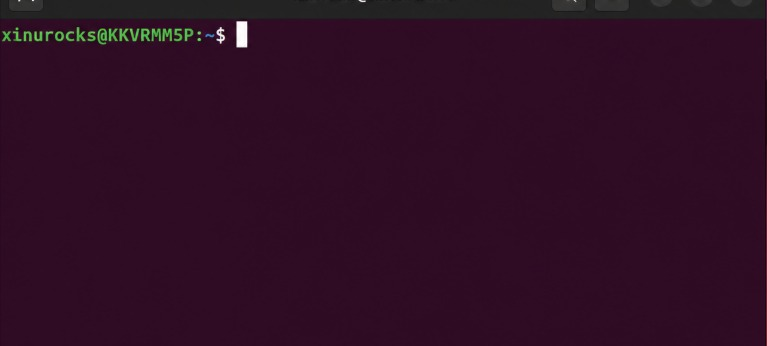

b. Jelaskan arti  dari command prompt milik Anda! 
       
        xinurocks       = username pengguna Linux
        @               = pemisah username dan hostname
        KKVRMM5P        = hostname/nama komputer
        :               = pemisah hostname dan direktori
        ~               = posisi direktori saat ini (home directory)
        $               = menandakan user biasa

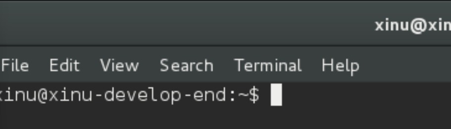

        xinu                    = username pengguna Linux.
        @                       = pemisah username dan hostname.
        xinu-develop-end        = hostname atau nama komputer.
        :                       = pemisah hostname dan direktori kerja.
        ~                       = home directory pengguna.
        $                       = menandakan user biasa (bukan root). 
        
### 2. Perintah pertama    
Setiap perintah pada Linux mempunyai bentuk umum: nama_perintah option command_line_argument Apabila terdapat perintah: ls -al / maka perintah tersebut berarti: nama_perintah = ls option (atau switch) = -al command_line_argument (atau parameter) = /

Catatan: beberapa perintah dapat berjalan tanpa adanya option maupun parameter, beberapa perintah hanya dapat berjalan jika diberikan parameter, perintah yang lain membutuhkan option dan parameter untuk dapat berjalan. Perintah bersifat case sensitif: perintah ls berbeda dengan perintah LS

Pertanyaan: 

a.Jalankan dan screenshot perintah berikut ini: ls 

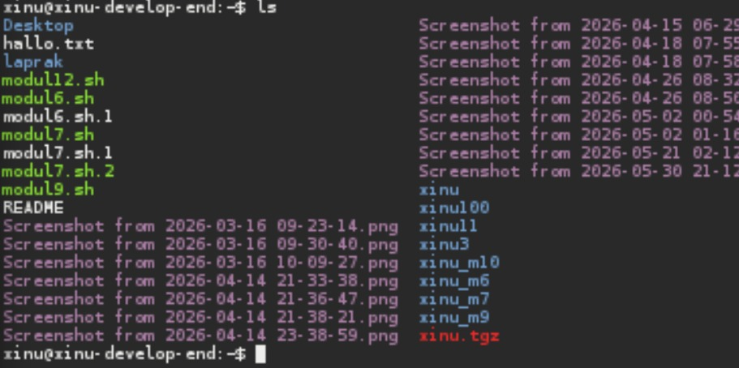
b.Apakah option dan parameter dari perintah di atas? 

                nama_perintah   = ls
                option          = tidak ada
                parameter       = tidak ada
c.Apa fungsi dari perintah tersebut?
        Perintah ls digunakan untuk menampilkan isi direktori/folder saat ini.
d.Jalankan perintah berikut ini: ls -al /

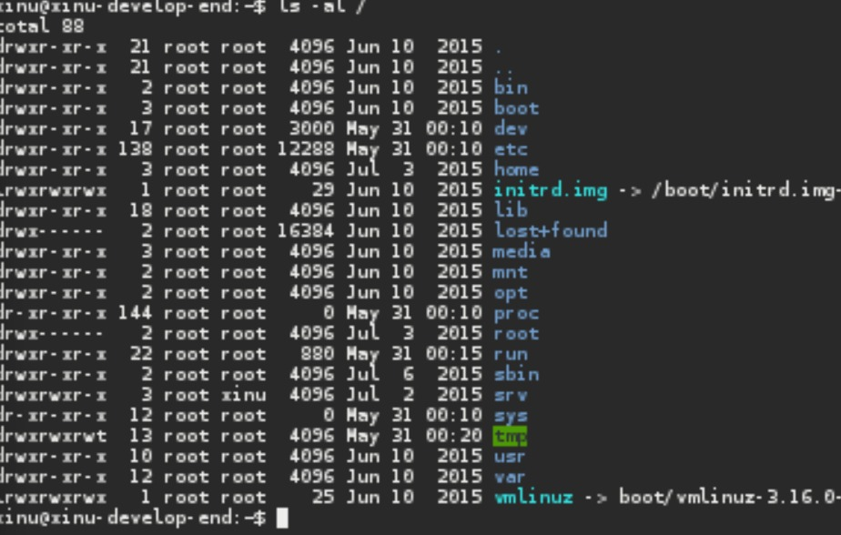
        
e.Apakah option dan parameter dari perintah di atas?

        nama_perintah   = ls
        option          = -al
        parameter       = /

f.Apa fungsi dari perintah tersebut?

        Menampilkan seluruh isi direktori root (/) secara detail 
        termasuk hidden file.
g.Jelaskan mengapa perintah pada a dan e mempunyai hasil yang berbeda!

        ls hanya menampilkan isi folder saat ini
        ls -al / menampilkan isi root directory secara detail
### 3. Pohon File
a. Jalankan perintah pwd

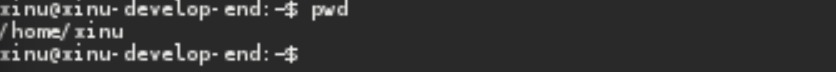
b. Option dan parameter

        option          = tidak ada
        parameter       = tidak ada
c. Fungsi perintah

        Menampilkan lokasi direktori saat ini.
        
### 4. Grafik yang digunakan versi berapa? Apakah sudah sesuai dengan
a. Jalankan dan screenshot perintah: cd /

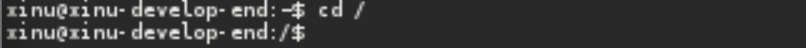
b. Apakah option dan parameter dari perintah tersebut? 
        option          = tidak ada
        parameter       = /
c. Apa yang dilakukan perintah tersebut?

        Berpindah ke root directory Linux.
### 5. Direktori khusus
 ~  disebut direktori home. Misalkan user bernama linus,mempunyai home directory /home/linus, dengan melakukan  cd ~ maka sama dengan cd /home/linus.
  .. merepresentasikan parent directory. Jika kita berada dalam folder /home dan kemudian mengeksekusi perintah cd .. berarti kita berpindah dari direktori /home ke parentnya yaitu direktori /
  . merupakan current directory, pada gambar pohon di atas jika kita berada pada folder /home/john maka untuk mengakses school dapat digunakan perintah ./Documents/school

Lakukan dan screenshot perintah cd / kemudian lakukan perintah cd ~. Jelaskan hasil dari keduanya! 
Lakukan perintah cd /proc/self. Buatlah perintah menggunakan cd .. agar dapat berpindah ke direktori / (root). Berapa kali perintah cd .. harus dieksekusi? Screenshot hasilnya!

a. Lakukan dan screenshot perintah cd / kemudian lakukan perintah cd ~. Jelaskan hasil dari keduanya! 

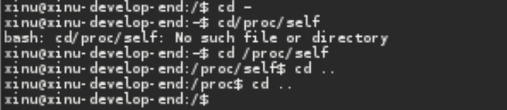
Perintah cd / digunakan untuk berpindah ke root directory Linux yaitu /. Setelah menjalankan perintah tersebut, posisi direktori berubah dari home directory ke root directory. Sedangkan perintah cd ~ digunakan untuk kembali ke home directory user, yaitu /home/xinurocks. Perubahan direktori dapat dilihat pada command prompt terminal.

b.Lakukan perintah cd /proc/self. Buatlah perintah menggunakan cd .. agar dapat berpindah ke direktori / (root). Berapa kali perintah cd .. harus dieksekusi? Screenshot hasilnya! 

Dilakukan sebanyak 2 kali, perintah cd /proc/self digunakan untuk masuk ke direktori /proc/self. Untuk kembali ke root directory /, digunakan perintah cd .. sebanyak dua kali. Perintah cd .. pertama akan berpindah ke direktori /proc, kemudian cd .. kedua akan berpindah kembali ke root directory /.
### 6. Copy, rename dan  delete file (screenshot setiap tahapan!) 
a. Copylah file dari /proc/cpuinfo ke folder home Anda (/home/user/) menggunakan command pada terminal.  Ganti user dengan username anda.

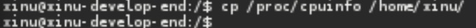

b. Tunjukkan menggunakan perintah bahwa file tersebut benar-benar telah dicopy ke folder home Anda. 

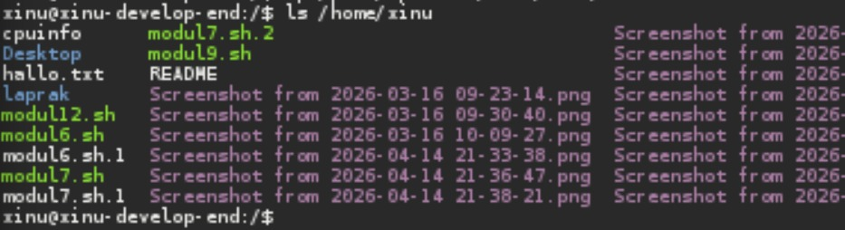

c. Copy file dari /proc/uptime ke folder home Anda.

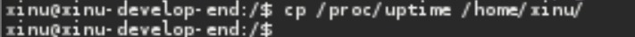

d. Tunjukkan menggunakan perintah bahwa file tersebut benar-benar telah dicopy ke folder home Anda. 

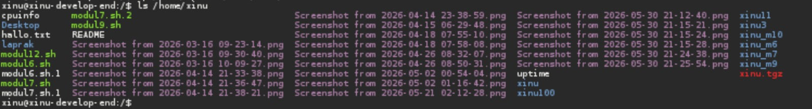

e. Hapuslah file uptime di folder home Anda. 

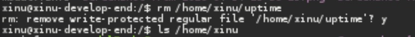

f. Tunjukkan menggunakan perintah bahwa file tersebut benar-benar telah dihapus ke folder home Anda. 

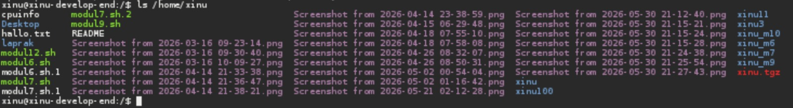

g. Rename file cpuinfo di folder home Anda menjadi infocpu

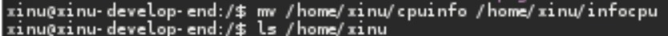
### 7. Membuat folder baru.
Hint: gunakan mkdir
Buatlah perintah-perintah sehingga dapat melakukan hal-hal berikut ini: (lakukan secara berurutan mulai dengan melakukan perintah cd ~)

a. Buatlah folder baru dengan nama “nim_anda”. 

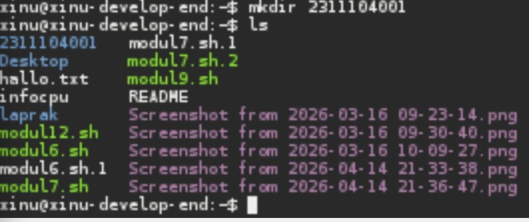
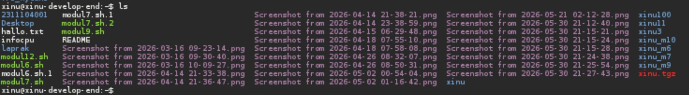

b. Buatlah di dalam folder “nim_anda”, folder baru dengan nama “nama_anda”. 

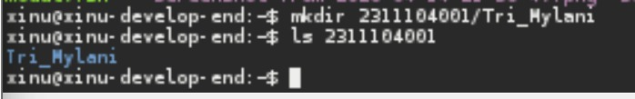

### 8. Membaca manual
Hint: gunakan man

a. Bukalah fungsi manual untuk perintah “ls”

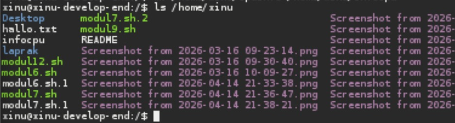
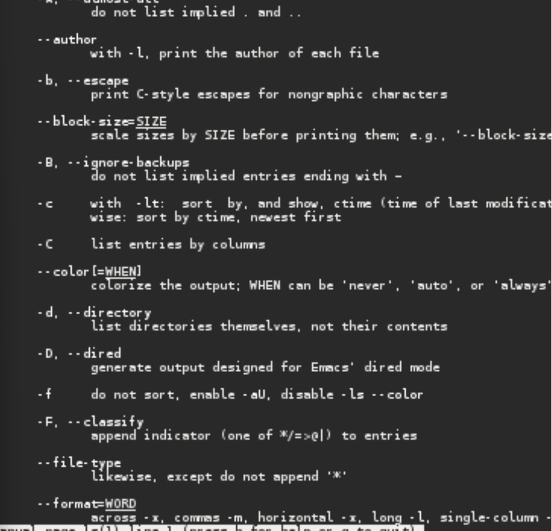

b. Apa fungsi perintah “ls”?

        Menampilkan isi direktori.
c. Siapakah pencipta perintah “ls”? 

        Richard M. Stallman dan David MacKenzie.
d. Apakah arti dari -h dari manual ls? 

        Menampilkan ukuran file dalam format mudah dibaca manusia.
e. Option apa yang harus digunakan agar dapat melihat direktori secara rekursif? 

        -R dan ls -R
f. Bukalah fungsi manual untuk perintah “cp” 

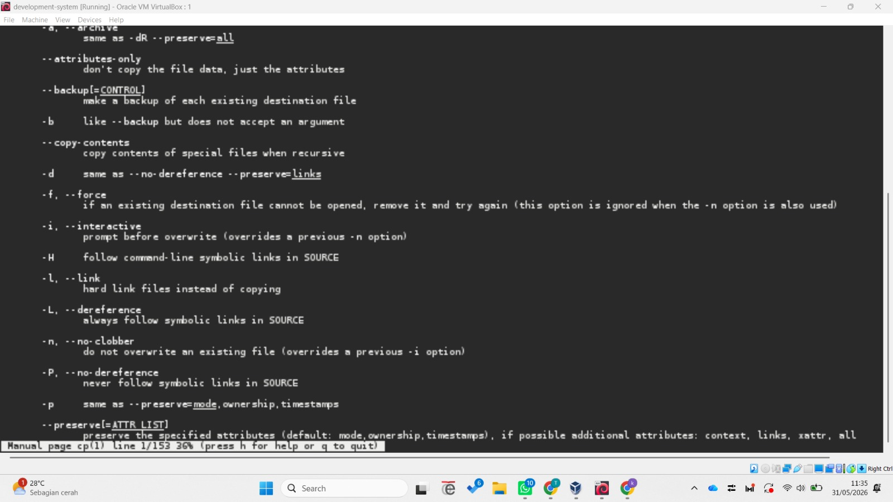

g. Apa fungsi perintah “cp”

        Menyalin file atau folder.
h. Siapakah pencipta perintah “cp”? 

        Torbjorn Granlund, David MacKenzie, dan Jim Meyering.
i. Apakah arti -v dalam perintah “cp? 

        Verbose, menampilkan proses penyalinan file.
j. Jika ingin interaktif, option apa yang harus digunakan? 
        -i dan cp -i file1 file2
### 9. Pipe 

a. Lakukan perintah ini cat /etc/passwd dan screenshot hasil perintah tersebut!

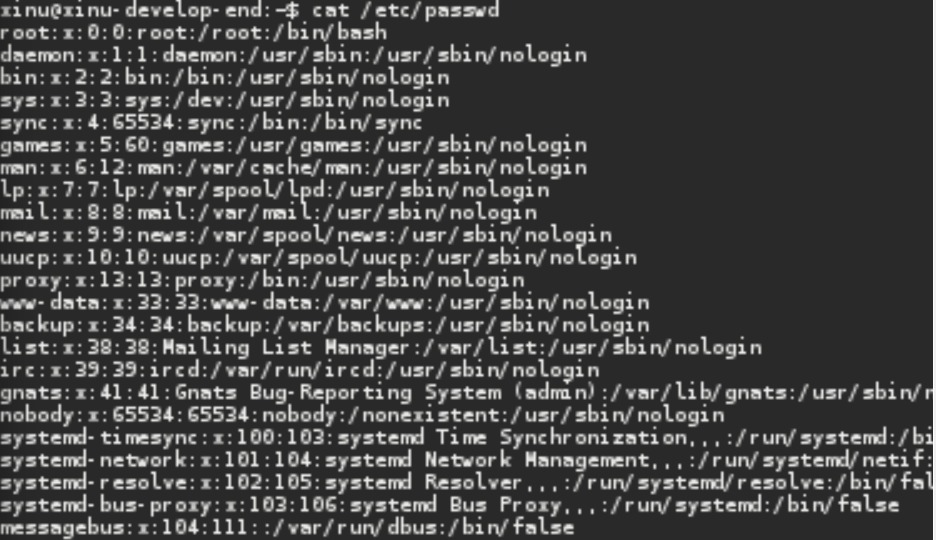

b. Apa fungsi perintah cat? 

        Menampilkan isi file.
c. Lakukan perintah cat /etc/passwd | grep daemon dan screenshot hasil perintah tersebut!

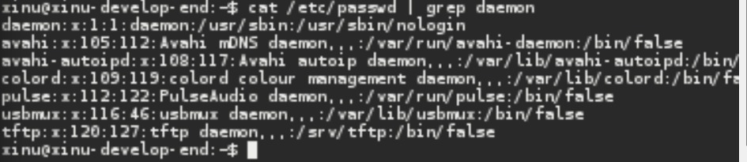

d. Lakukan perintah cat /etc/passwd | grep root dan screenshot hasil perintah tersebut!

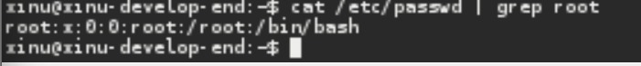

e. Lakukan perintah cat /etc/passwd | grep nobody dan screenshot hasil perintah tersebut!

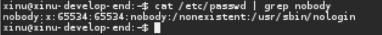

f. Apakah fungsi perintah “ | grep daemon”? 

        Perintah grep daemon digunakan untuk mencari baris yang mengandung kata daemon. Simbol pipe (|) berfungsi untuk meneruskan output dari perintah sebelumnya (cat /etc/passwd) ke perintah grep.

### 10. Redirection 
a. Lakukan perintah dan jelaskan hasilnya

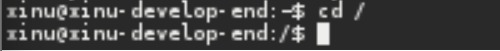
Perintah cd / digunakan untuk berpindah ke direktori root (/).

b. ls -al > /home/user/result.txt
Ganti user dengan username ubuntu anda.

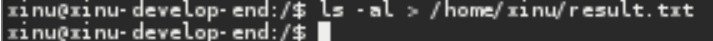
Hasil dari perintah ls -al tidak ditampilkan ke layar terminal, tetapi disimpan ke file result.txt.

c. Dimana file result.txt berada?

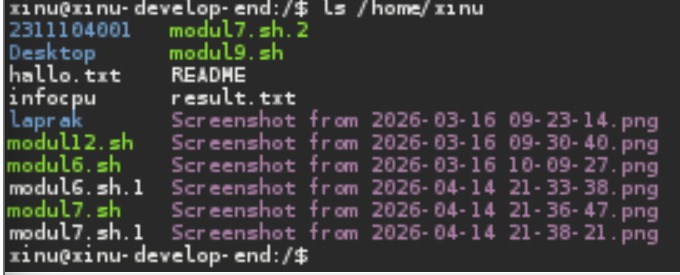

d. Lakukan perintah dan jelaskan hasilnya
cd /etc
ls -al > /home/user/result.txt
Ganti user dengan username ubuntu anda.

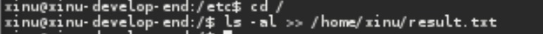
Isi file result.txt akan diganti dengan hasil ls -al dari direktori /etc.

e. Apakah fungsi dari perintah >? 

        Operator > digunakan untuk mengalihkan output (redirect output) ke sebuah file.
        Jika file belum ada maka akan dibuat.
        Jika file sudah ada maka isinya akan ditimpa (overwrite).

f. Lakukan perintah dan jelaskan hasilnya
cd /
ls -al >> /home/user/result1.txt
Ganti user dengan username ubuntu anda.
Lakukan perintah dan jelaskan hasilnya
cd /etc
ls -al >> /home/user/result1.txt
Ganti user dengan username ubuntu anda.

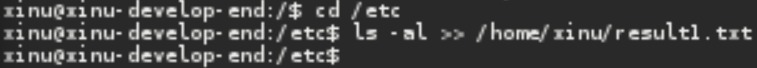
        Hasil ls -al dari direktori root ditambahkan ke file result1.txt.

g. Apakah perbedaan perintah > dan >>?

        >       = overwrite/menimpa
        >>      = append/menambah isi

## II. Kompile Source Code (Total 17 Poin)
Pastikan gcc sudah terinstall pada Ubuntu anda menggunakan gcc --version 
Panggil atau hubungi asisten praktikum apabila gcc belum terinstall!

Hint: 
gcc –o output file
./
Screenshot setiap tahapan yang anda lakukan terhadap Ubuntu!

### 1. Buatlah file dengan nama 2_1.c yang berisi:

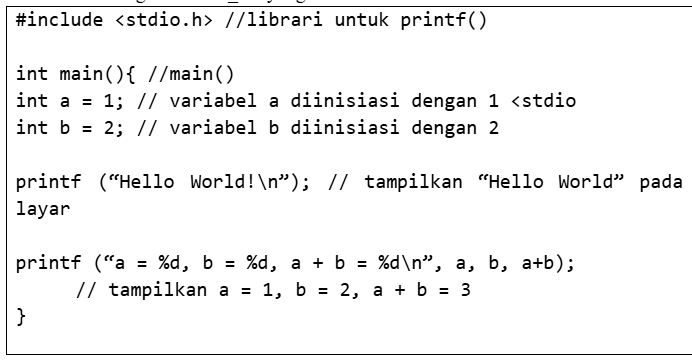

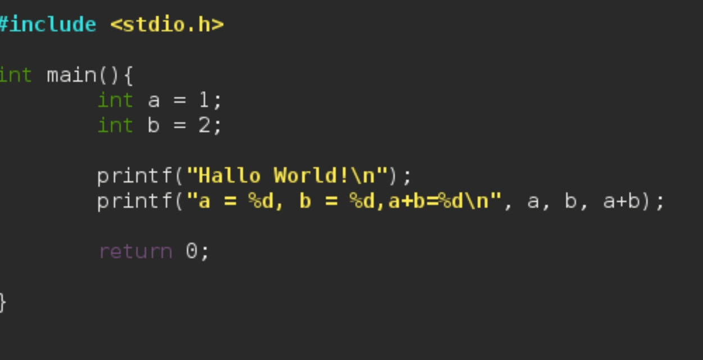

### 2. Kompile source code tersebut menggunakan gcc! Nama output program adalah 2_1 (bukan a.out). Tuliskan perintah untuk mengkompile source code tersebut! 

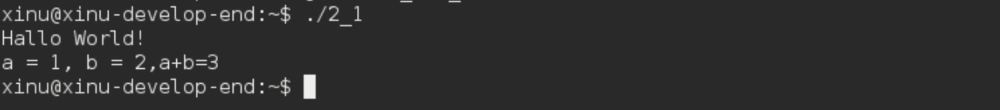

### 3. Jalankan program yang baru saja Anda kompile. Tuliskan perintah untuk menjalankan program tersebut!

### 4. Buatlah file dengan nama 2_2.c yang berisi:

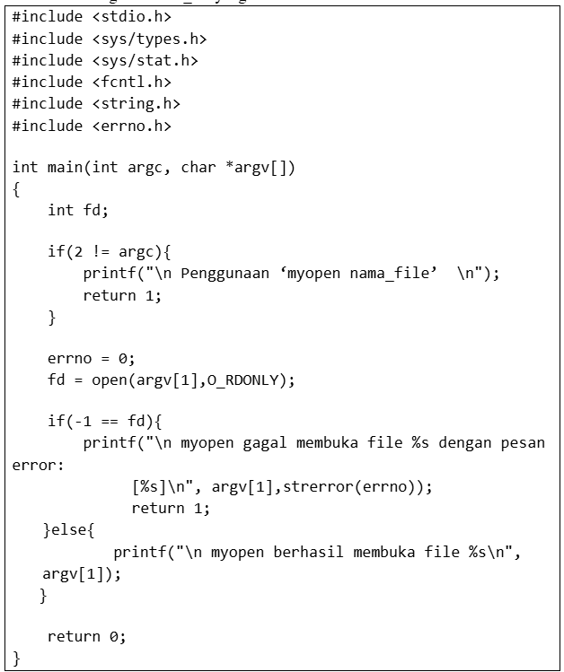

## 5. Kompile source code tersebut menggunakan gcc! Nama output program adalah “myopen”. Tulis perintah untuk mengkompile source code tersebut. 

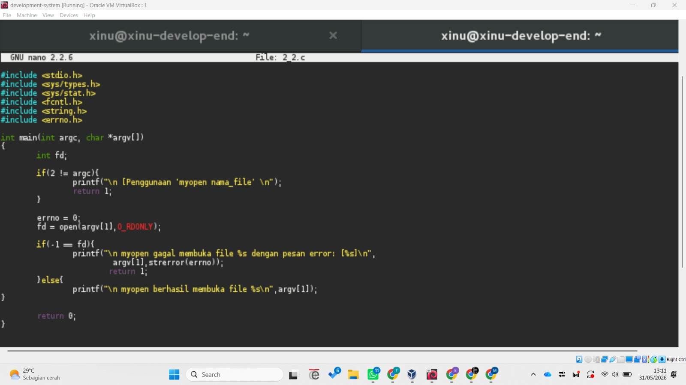

### 6. Jalankan program myopen yang baru saja Anda buat! Tuliskan perintah untuk menjalankan program myopen.

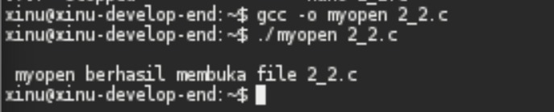

### 7. Jelaskan apa yang dilakukan program tersebut! 

        Program myopen digunakan untuk mencoba membuka file yang diberikan sebagai parameter saat program dijalankan. Jika file berhasil dibuka, program akan menampilkan pesan bahwa file berhasil dibuka. Jika file tidak ditemukan atau tidak dapat diakses, program akan menampilkan pesan kesalahan sesuai dengan error yang diberikan oleh sistem operasi. Dengan demikian program ini digunakan untuk memeriksa keberhasilan proses pembukaan file dan menampilkan informasi error apabila terjadi kegagalan.

        
## Referensi
1. Xinu Project. (2024). Embedded Xinu Documentation. Diakses dari: https://xinu.cs.purdue.edu
2. Oracle VM VirtualBox Documentation. Oracle Corporation. https://www.virtualbox.org
3. Sourcetrail Documentation. Coati Software. https://www.sourcetrail.com
