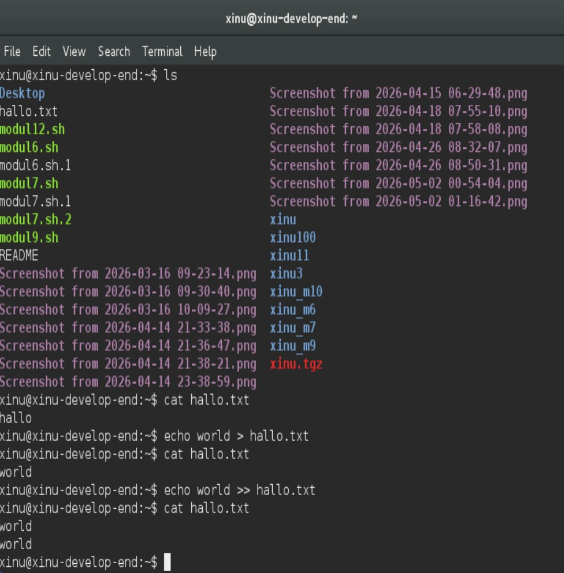
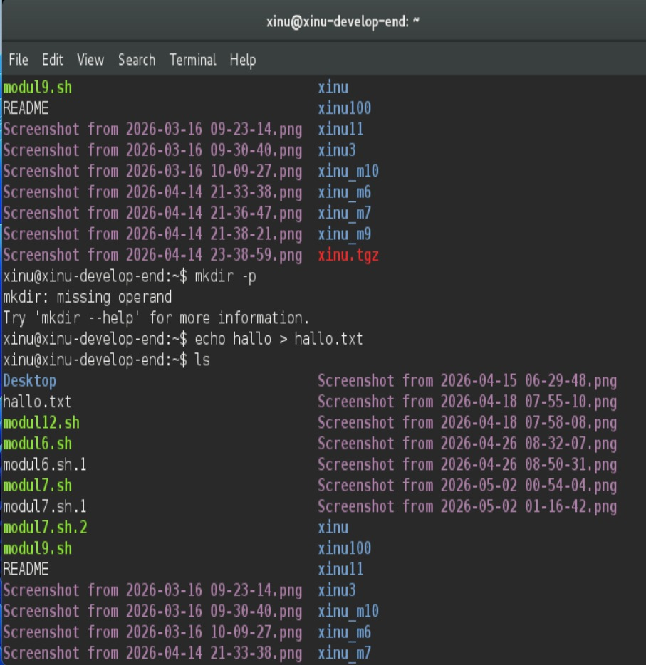
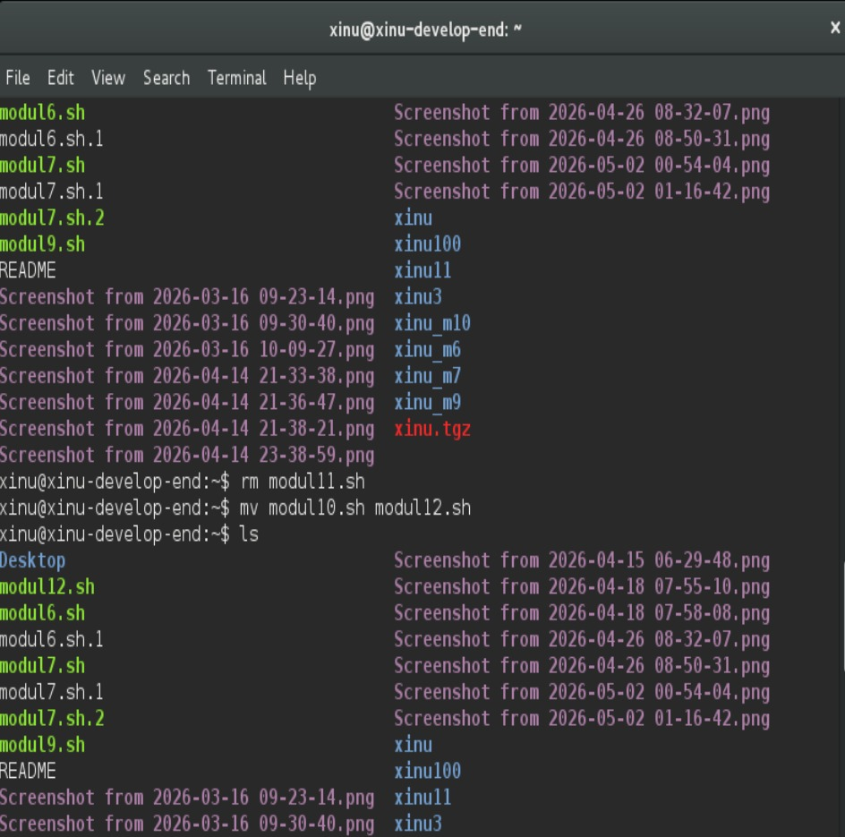
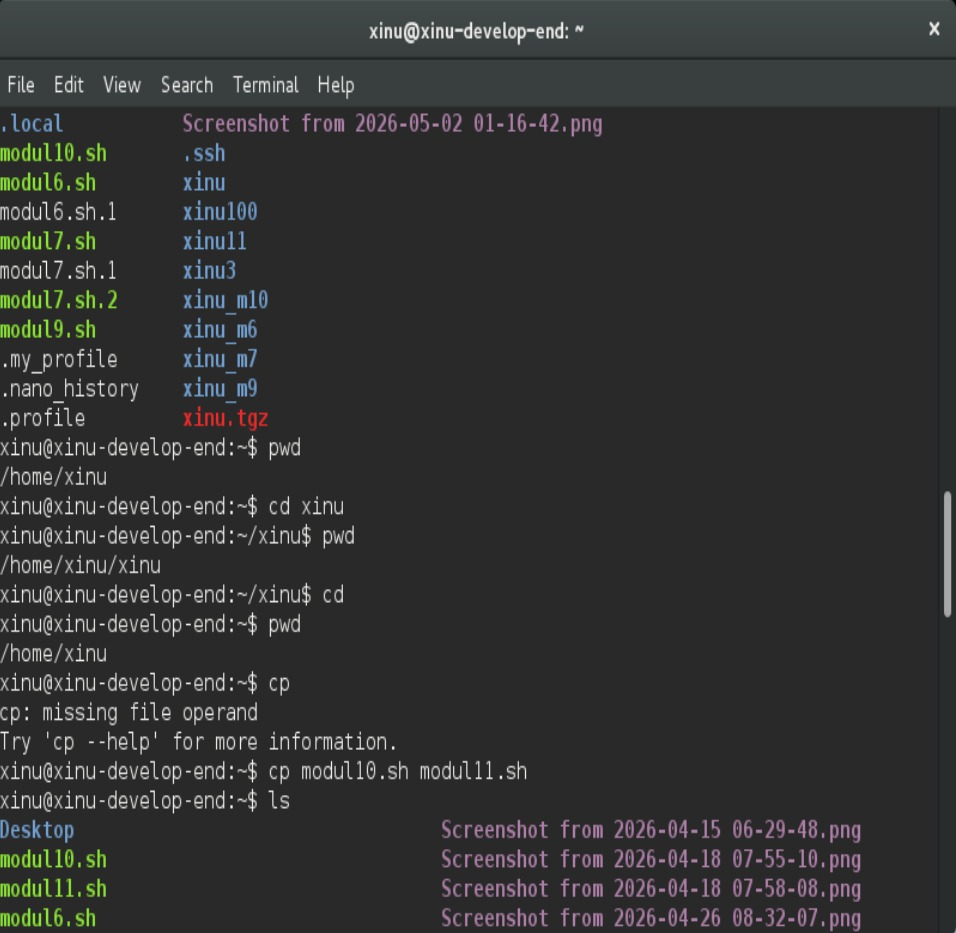
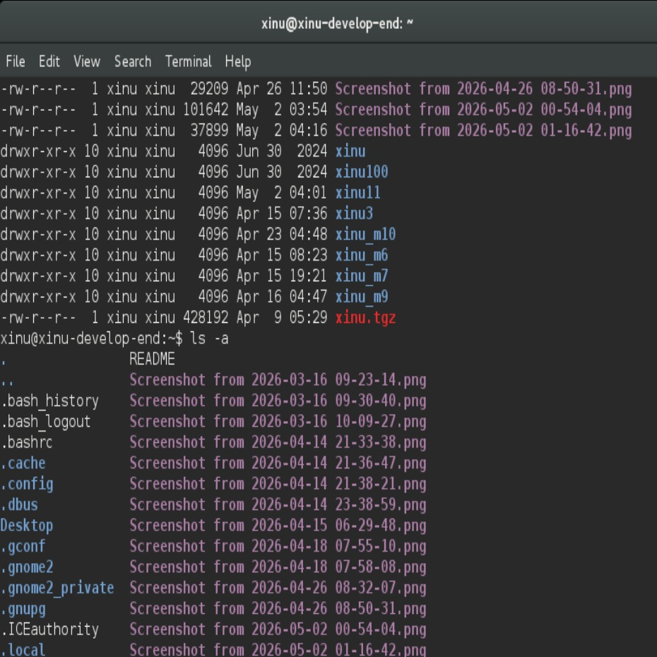
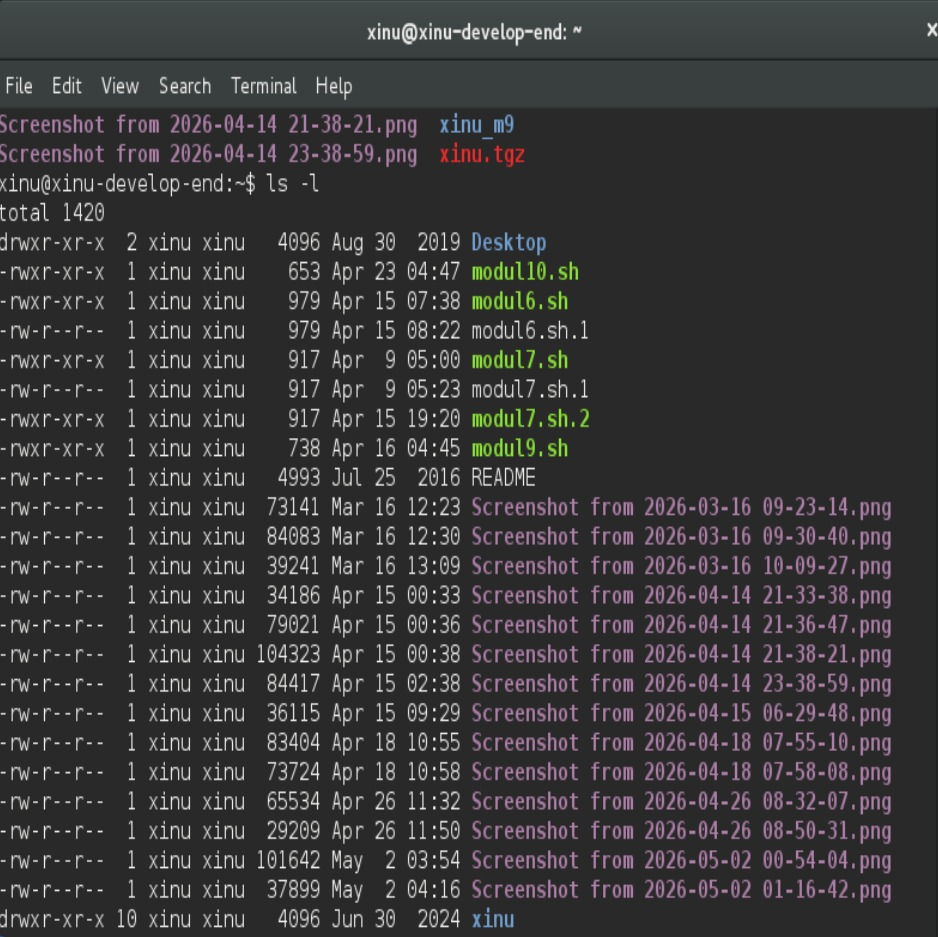
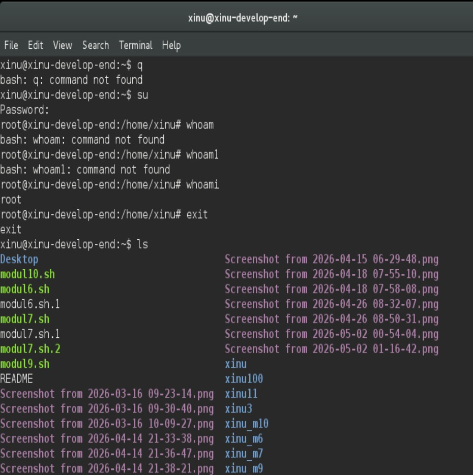

# <h1 align="center">Laporan Praktikum Modul 13  Perintah Dasar Linux</h1>

Tri Mylani - 2311104001

## Dasar Teori
    Perintah dasar Ubuntu merupakan kumpulan instruksi yang digunakan pengguna untuk berinteraksi dengan sistem operasi Linux melalui terminal. Dengan menggunakan perintah dasar, pengguna dapat melakukan berbagai aktivitas seperti melihat isi direktori, berpindah folder, membuat file atau folder, menyalin data, menghapus file, hingga menjalankan program. Beberapa perintah yang sering digunakan antara lain ls untuk menampilkan isi direktori, pwd untuk mengetahui lokasi direktori saat ini, cd untuk berpindah direktori, serta mkdir, cp, mv, dan rm untuk mengelola file maupun folder. Penggunaan terminal pada Ubuntu sangat penting karena memberikan kontrol yang lebih cepat dan efisien dibandingkan penggunaan antarmuka grafis.

    Selain itu, Ubuntu juga menyediakan fitur lain seperti pipe dan redirection yang membantu pengguna mengolah output dari suatu perintah. Pipe (|) digunakan untuk menghubungkan output suatu perintah menjadi input bagi perintah lainnya, sedangkan redirection (> dan >>) digunakan untuk menyimpan hasil output ke dalam file. Ubuntu juga memiliki manual command (man) yang berfungsi sebagai dokumentasi bantuan untuk setiap perintah Linux. Dengan memahami perintah dasar Ubuntu, pengguna dapat lebih mudah mengoperasikan sistem Linux, melakukan administrasi sistem, serta mendukung proses pengembangan perangkat lunak dan scripting di lingkungan Linux.

## Guided
    1. Virtual machine Ubuntu dijalankan di VirtualBox.
    2. File ISO Ubuntu berhasil booting.
    3. Sistem Ubuntu masuk ke mode live (coba Ubuntu tanpa instalasi penuh).
    4. Karena sistem sudah aktif, Ubuntu menampilkan layar login dengan user bawaan bernama “Live session user”.

## Referensi

1. Xinu Project. (2024). Embedded Xinu Documentation. Diakses dari: https://xinu.cs.purdue.edu
2. Oracle VM VirtualBox Documentation. Oracle Corporation. https://www.virtualbox.org
3. Sourcetrail Documentation. Coati Software. https://www.sourcetrail.com
