# <h1 align="center">Laporan Praktikum Modul 14   Scripting </h1>

Tri Mylani - 2311104001

## Cara compile dan run Bash Script:

        chmod +x nama_file.sh
        ./nama_file.sh

### 1.  PERMULAAN
#### a. Buatlah file bernama greeting.sh sesuai dengan template code.

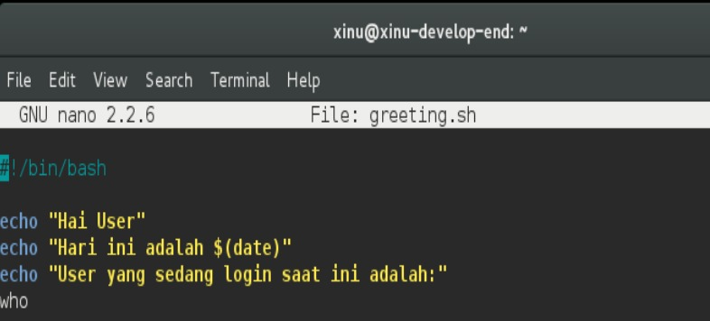
#### b. Buatlah script pada greeting.sh sehingga:

        i. Dapat menyapa user
        ii. Menampilkan tanggal hari ini
        iii. Menampilkan user yang sedang login saat ini
Contoh eksekusi:
$./greeting.sh

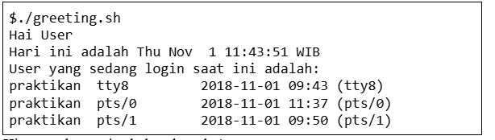
Hint: gunakan perintah date dan who!

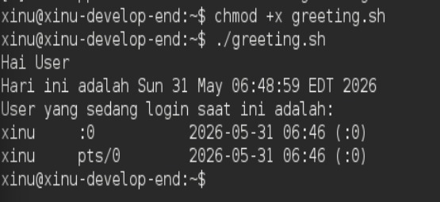

#### 2.  PENGONDISIAN 
#### a. Buatlah file bernama greeting_1.sh sesuai dengan template code.

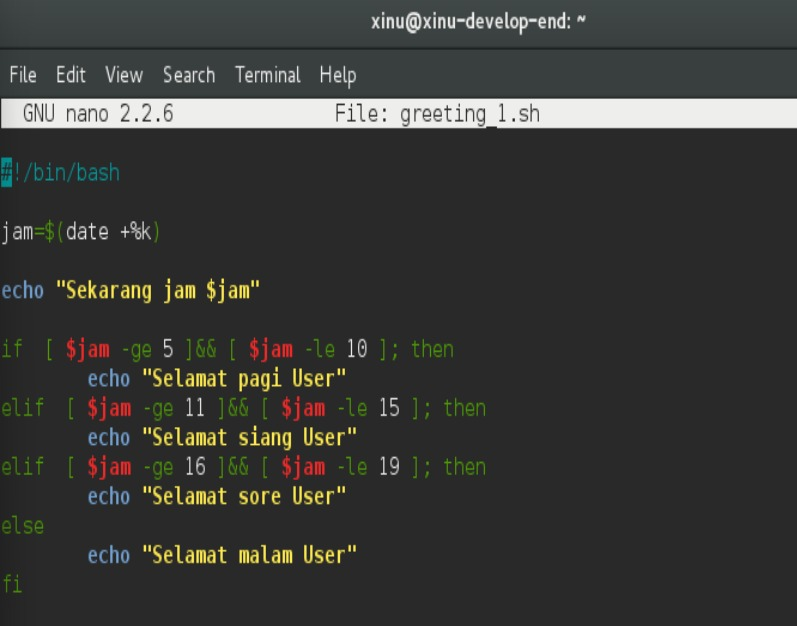
#### b. Buatlah script pada greeting_1.sh sehingga dapat menampilkan “selamat pagi” pada pagi hari (05:01-10:00), “selamat siang” pada siang hari (10:01-15:00), “selamat sore” pada sore hari (15:01-19:00) “selamat malam” pada malam hari (19:01-05:00).

Hint: gunakan date +%k 

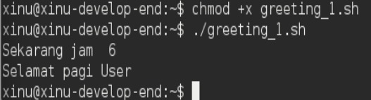

#### 3.  PERULANGAN  
#### a. Buatlah file bernama countdown.sh sesuai dengan template code.

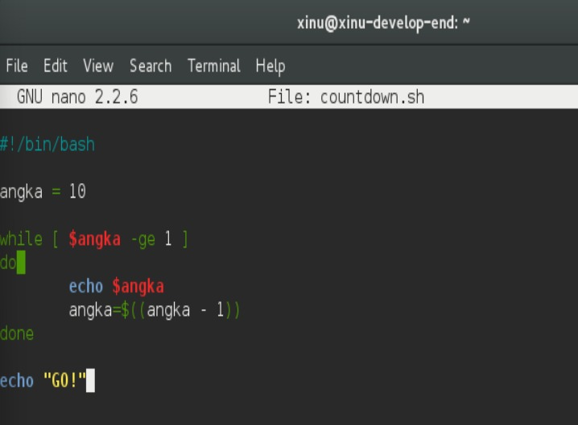
#### b. Buatlah script sehingga menghasilkan countdown dimulai dari angka 10 hingga angka 1 lalu diikuti tulisan “GO!”.

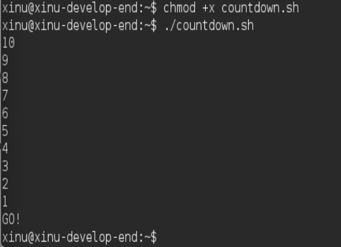

#### 4.  INPUT PENGGUNA   
#### a. Buatlah file bernama countdown_1.sh sesuai dengan template code. 

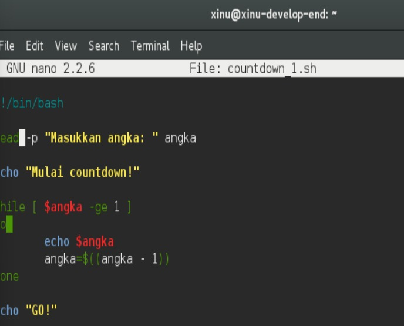
#### b. Buatlah script sehingga menghasilkan countdown berdasarkan masukan dari user. 

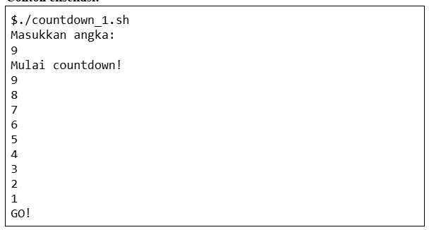
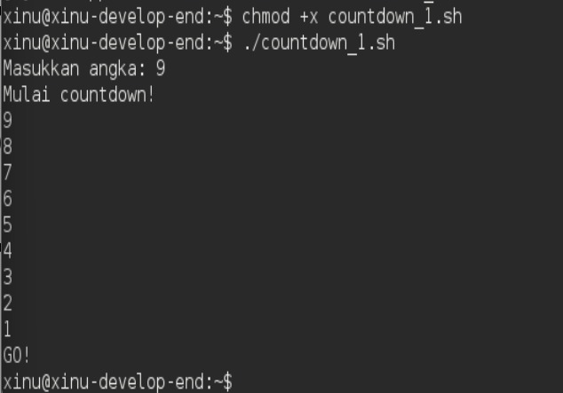

#### 5.  PARAMETER SCRIPT   
#### a. Buatlah file bernama countdown_2.sh sesuai dengan template code.

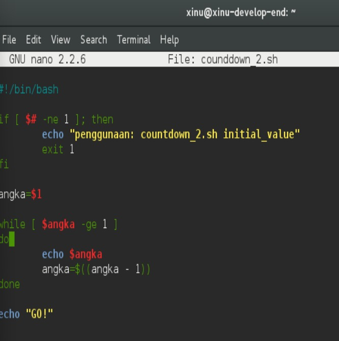
#### b. Buatlah script sehingga menghasilkan countdown berdasarkan parameter script. Pastikan kondisi-kondisi lain ditangani. 

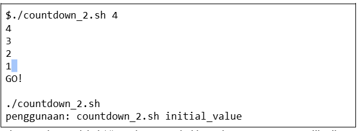
Hint: gunakan variabel $# untuk mengetahui banyaknya argumen yang diberikan

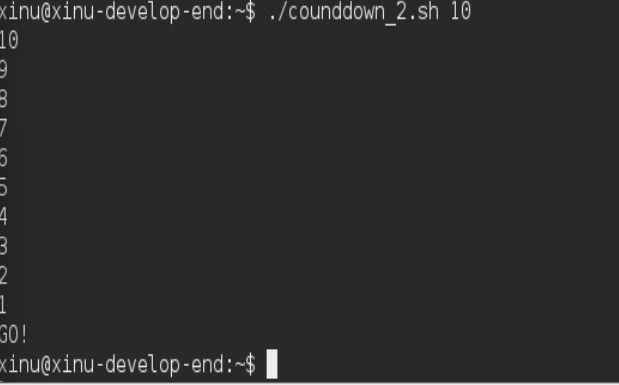

#### 6.  PENGONDISIAN    
#### a. Buatlah file bernama list_direktori.sh. Jangan lupa untuk mengubah ijin script sehingga dapat dieksekusi.

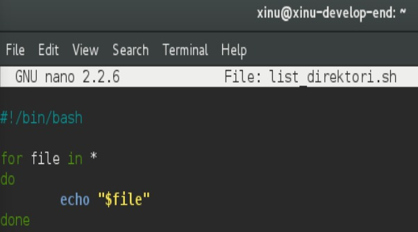
#### b. Buatlah script sehingga menampilkan semua file pada direktori tersebut.
 
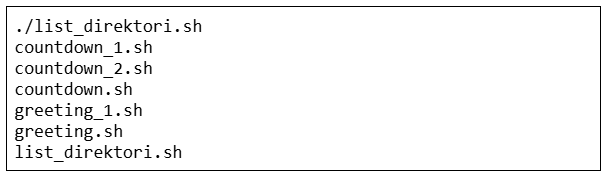

Hint: gunakan * pada bagian “for in”

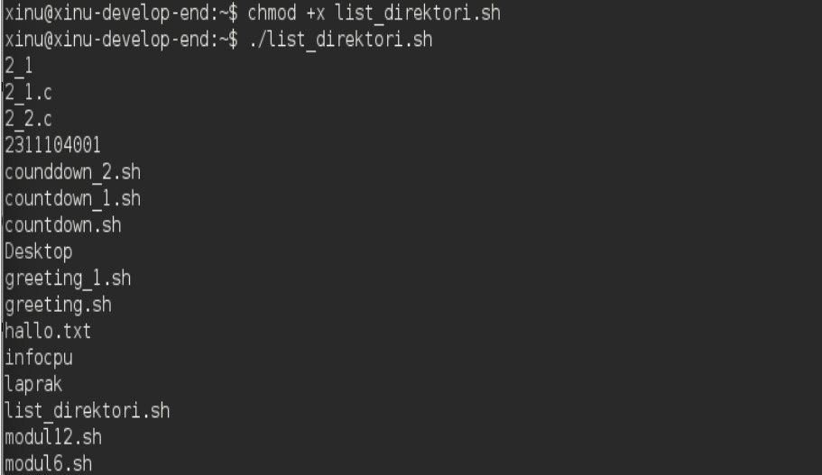

        
## Referensi
1. Xinu Project. (2024). Embedded Xinu Documentation. Diakses dari: https://xinu.cs.purdue.edu
2. Oracle VM VirtualBox Documentation. Oracle Corporation. https://www.virtualbox.org
3. Sourcetrail Documentation. Coati Software. https://www.sourcetrail.com
