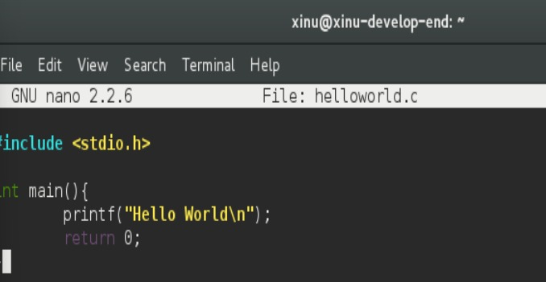
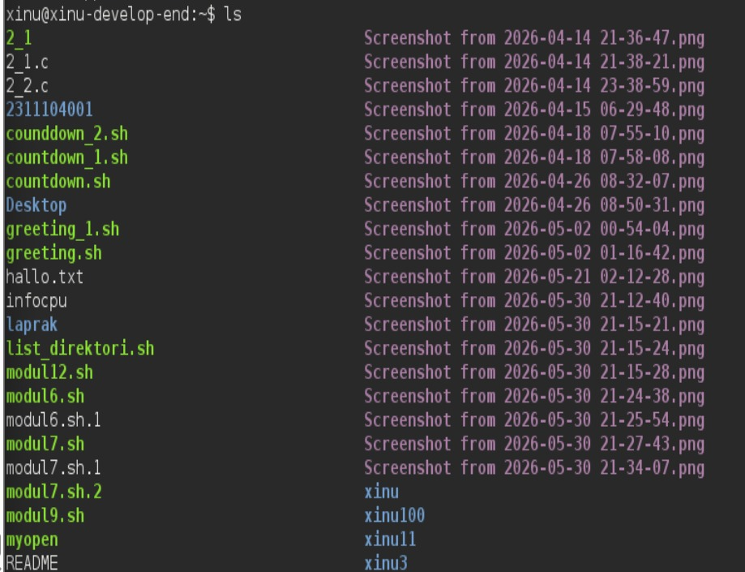
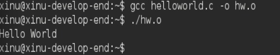
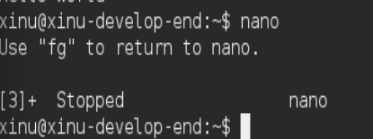
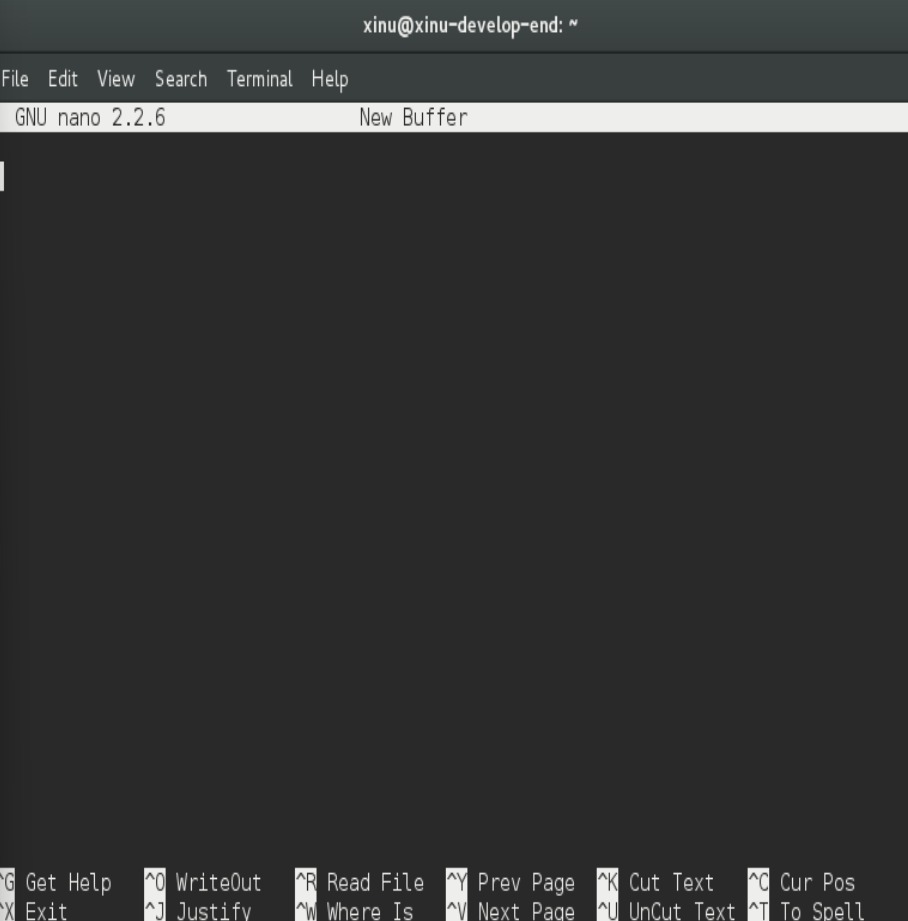
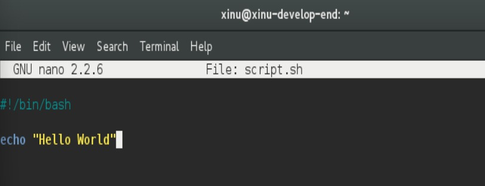
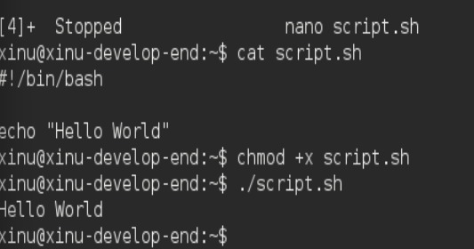

# <h1 align="center">Laporan Praktikum Modul 14  Scripting</h1>

Tri Mylani - 2311104001

## Dasar Teori
    Scripting pada Ubuntu adalah proses membuat dan menjalankan kumpulan perintah dalam sebuah file script untuk mengotomatisasi berbagai tugas pada sistem operasi Linux. Umumnya, scripting menggunakan Bash (Bourne Again Shell) sebagai interpreter yang memungkinkan pengguna menjalankan perintah secara berurutan, menerima input, melakukan pengondisian, perulangan, serta mengelola file dan direktori secara otomatis. Dengan Bash scripting, pekerjaan yang dilakukan berulang kali dapat diselesaikan dengan lebih cepat, efisien, dan mengurangi kemungkinan kesalahan akibat proses manual.

## Guided
    1. Virtual machine Ubuntu dijalankan di VirtualBox.
    2. File ISO Ubuntu berhasil booting.
    3. Sistem Ubuntu masuk ke mode live (coba Ubuntu tanpa instalasi penuh).
    4. Karena sistem sudah aktif, Ubuntu menampilkan layar login dengan user bawaan bernama “Live session user”.

## Referensi

1. Xinu Project. (2024). Embedded Xinu Documentation. Diakses dari: https://xinu.cs.purdue.edu
2. Oracle VM VirtualBox Documentation. Oracle Corporation. https://www.virtualbox.org
3. Sourcetrail Documentation. Coati Software. https://www.sourcetrail.com
