# <h1 align="center">Laporan Praktikum Modul 15   Keamanan Linux </h1>

Tri Mylani - 2311104001

### 1.  Integritas: dasar hashing [10 Point]
#### a. [2 Point] Lakukan hash SHA256, SHA512 dan MD5 untuk file /etc/passwd. Berapa nilai hash dari file /etc/passwd? Screenshot nilai hash dari file tersebut.

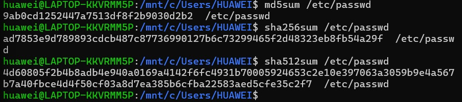

#### b.[2 Point] Buatlah file bernama test_0.txt pada folder /home/praktikan. Isi file tersebut isi yang ada di file /etc/passwd (copy paste isi file /etc/passwd ke test_0.txt)

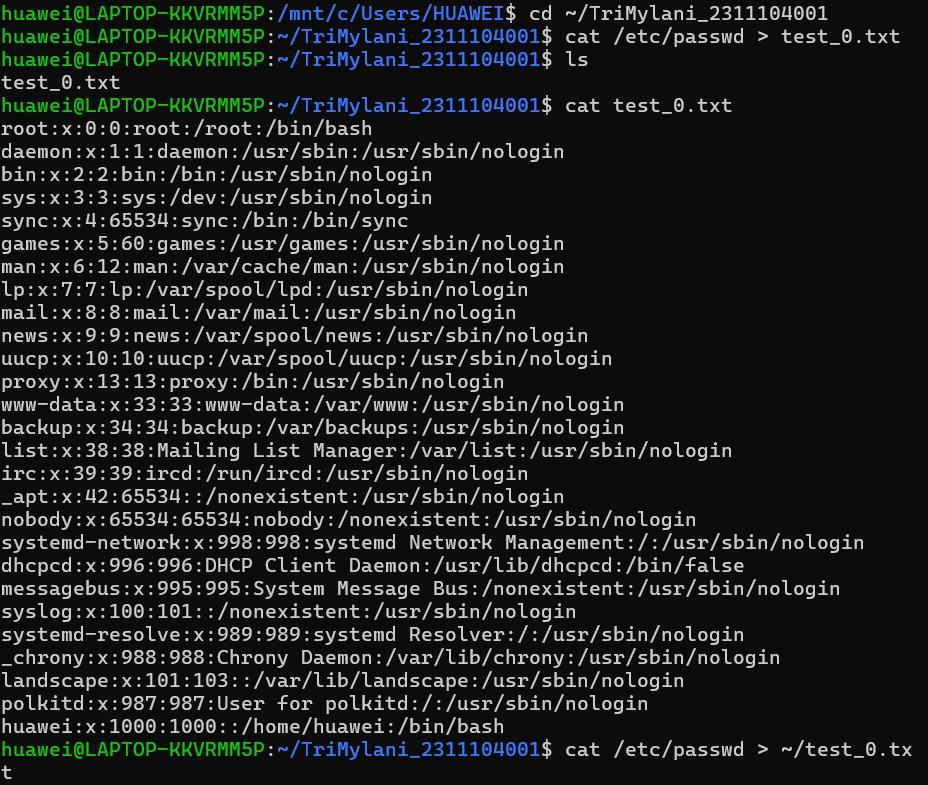

#### c. [2 Point] Lakukan hash SHA256, SHA512 dan MD5 untuk file test_0.txt. Berapa nilai hash dari file test_0.txt? Screenshot nilai hash dari file test_0.txt.

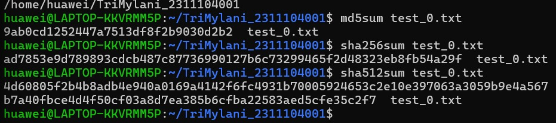

#### d.  [2 Point] Rename file test_0.txt menjadi file_0.txt. Lakukan hash SHA256, SHA512 dan MD5 untuk file_0.txt. Berapa nilai hash file_0.txt? Screenshot nilai hash dari file_0.txt.

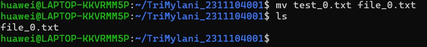

#### e. [2 Point] Apa hasil pengamatan Anda? File apa saja yang mempunyai hash yang sama? Jelaskan

        Berdasarkan hasil percobaan, nilai hash MD5, SHA256, dan SHA512 setelah teks "abcdef" dihapus kembali menjadi sama dengan nilai hash awal sebelum penambahan "abcdef". Hal ini terjadi karena isi file setelah penghapusan kembali identik dengan isi file semula.

        Saat teks "abcdef" ditambahkan, isi file berubah sehingga nilai hash juga berubah. Namun setelah teks tersebut dihapus dan file disimpan, isi file kembali seperti kondisi awal sehingga algoritma hash menghasilkan nilai yang sama seperti sebelumnya.

        Dari percobaan ini dapat disimpulkan bahwa nilai hash bergantung sepenuhnya pada isi file. Jika isi file sama, maka nilai hash yang dihasilkan juga akan sama. Sebaliknya, jika terdapat perubahan sekecil apa pun pada isi file, maka nilai hash akan berubah.

### 2.  Integritas: dasar hashing [10 Point]
#### a. [3 Point] Download file bernama test_1.txt di link ini tiny.cc/test1_txt

#### b. [3 Point] Lakukan hash SHA256, SHA512 dan MD5 untuk file test_1.txt. Berapa nilai hash test_1.txt? Screenshot nilai hash dari file test_1.txt.

#### c. [3 Point] Hapuslah titik diakhir file test_1.txt tersebut, simpan file tersebut!

#### d.  Lakukan hash dari SHA256, SHA512 dan MD5. Screenshot nilai hash dari file test_1.txt. 

#### e. [3 Point] Apa analisis (hasil pengamatan) Anda mengenai hal tersebut! Apakah nilai hash sama?

        Tidak, nilai hash tidak sama. Setelah satu karakter (tanda titik) dihapus dari file test_1.txt, nilai hash MD5, SHA256, dan SHA512 berubah seluruhnya. Hal ini membuktikan adanya Avalanche Effect, yaitu perubahan kecil pada input menghasilkan perubahan besar pada output hash.

### 3.  Integritas: dasar hashing [10 Point]
#### a. [3 Point] Download file bernama test_1.doc di link ini tiny.cc/test1_doc

#### b. [3 Point] Lakukan hash SHA256, SHA512 dan MD5 untuk file test_1.doc. Screenshot nilai hash dari file test_1.doc.

#### c. Buka kembali file test_1.doc. Lakukan hal ini:
        1. [3 Point] Ketik abcdef. Save test_1.doc 

        2. [3 Point] Hapus abcdef. Save test_1.doc 

#### d.  [3 Point] Lakukan hash SHA256, SHA512 dan MD5 untuk file test_1.doc. Screenshot nilai hash dari file test_1.doc. 

#### e. [3 Point] Hasil pengamatan apa yang diperoleh? Jelaskan alasannya! 

        Berdasarkan hasil percobaan, nilai hash MD5, SHA256, dan SHA512 setelah teks "abcdef" dihapus kembali menjadi sama dengan nilai hash awal sebelum penambahan "abcdef". Hal ini terjadi karena isi file setelah penghapusan kembali identik dengan isi file semula.

        Saat teks "abcdef" ditambahkan, isi file berubah sehingga nilai hash juga berubah. Namun setelah teks tersebut dihapus dan file disimpan, isi file kembali seperti kondisi awal sehingga algoritma hash menghasilkan nilai yang sama seperti sebelumnya.

        Dari percobaan ini dapat disimpulkan bahwa nilai hash bergantung sepenuhnya pada isi file. Jika isi file sama, maka nilai hash yang dihasilkan juga akan sama. Sebaliknya, jika terdapat perubahan sekecil apa pun pada isi file, maka nilai hash akan berubah.

### 4.  Integritas: dasar hashing [10 Point]
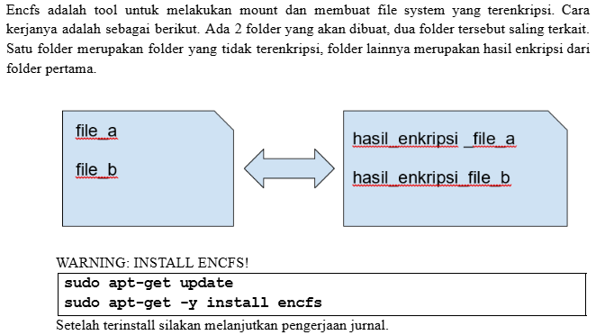
#### a. [5 Point] Jalankan perintah berikut: encfs ~/folder_anda/folder_terenkripsi ~/folder_anda/folder_normal Pilih y (enter), pilih y (enter), enter, kemudian buatlah password. Ingatlah password yang dibuat. Setelah selesai, perhatikan bahwa telah muncul folder bernama folder_normal dan folder_terenkripsi.

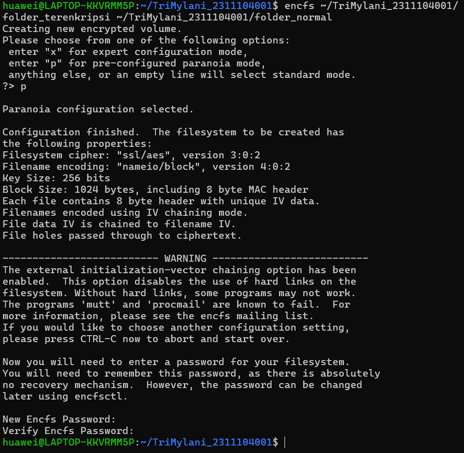

#### b. [5 Point] Copy dua atau tiga buah file (file apa saja) ke folder_normal. Amati dan tulis hasil observasi Anda pada folder_terenkripsi! 

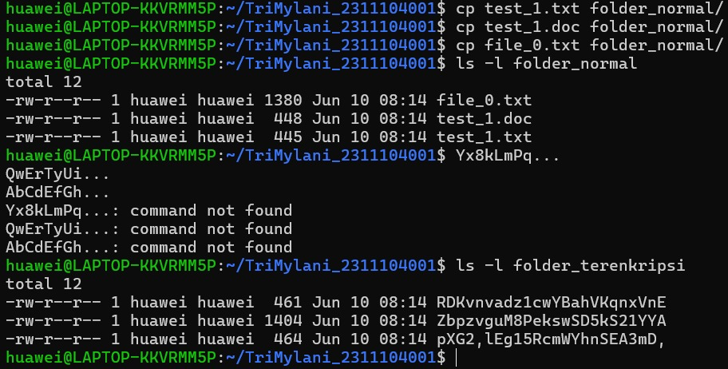

        Berdasarkan hasil percobaan, file yang disalin ke folder_normal dapat dilihat dan diakses menggunakan nama file aslinya. Namun, pada folder_terenkripsi, file yang sama disimpan dalam bentuk terenkripsi sehingga nama file berubah menjadi karakter acak dan isi file tidak dapat dibaca secara langsung.

        Hal ini menunjukkan bahwa EncFS melakukan enkripsi secara transparan. Pengguna bekerja pada folder_normal dengan file yang dapat dibaca, sedangkan data yang tersimpan secara fisik pada folder_terenkripsi telah terenkripsi untuk menjaga kerahasiaan data.   

#### c. [5 Point] Hapus salah satu file (bebas) pada folder_terenkripsi. Amati dan tulis hasil observasi Anda pada folder_normal!

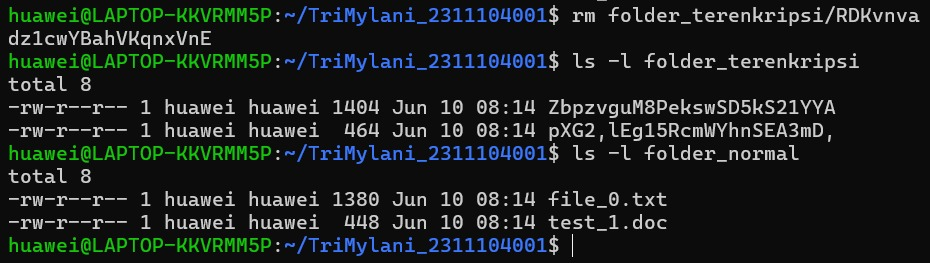

        Setelah satu file pada folder_terenkripsi dihapus, satu file yang bersesuaian pada folder_normal juga ikut hilang. Hal ini menunjukkan bahwa kedua folder terhubung dan merepresentasikan data yang sama, hanya berbeda bentuk penyimpanannya (terenkripsi dan tidak terenkripsi).

#### d.  [5 Point] Lakukan umount dengan perintah: Fusermount -u ~/folder_anda/folder_normal. Amati dan tulis hasil observasi Anda pada folder_normal dan folder_terenkripsi

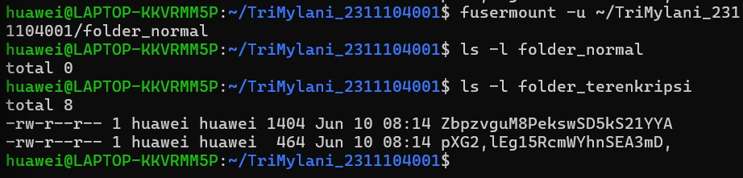

        Berdasarkan hasil percobaan, setelah dilakukan unmount menggunakan perintah fusermount -u, folder_normal tidak lagi menampilkan file yang telah didekripsi. Folder tersebut kembali menjadi folder biasa dan akses ke data terenkripsi tidak dapat dilakukan melalui folder_normal.

        Sementara itu, file-file pada folder_terenkripsi tetap ada dan tidak mengalami perubahan. Hal ini menunjukkan bahwa proses unmount hanya memutus hubungan antara folder_normal dan folder_terenkripsi, tetapi tidak menghapus data yang tersimpan. Data terenkripsi tetap berada pada folder_terenkripsi dan dapat diakses kembali apabila dilakukan mount ulang menggunakan EncFS dengan password yang benar.

#### e. [7 Point] Buatlah folder baru bernama folder_sembarang. Lakukan perintah berikut ini: encfs ~/folder_anda folder_terenkripsi ~/folder_anda/folder_sembarang. Amati dan tulis hasil observasi Anda!

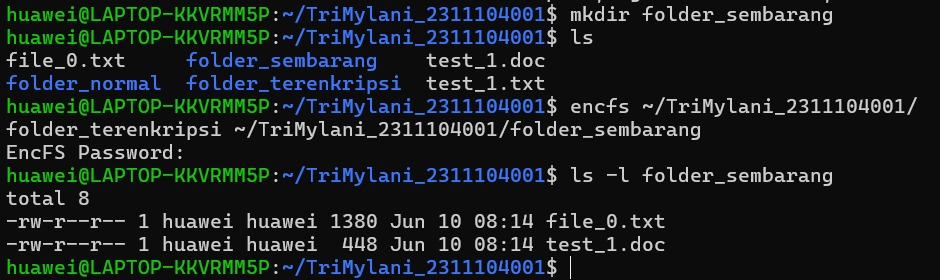

        Berdasarkan hasil percobaan, folder_terenkripsi dapat diakses kembali menggunakan folder lain, yaitu folder_sembarang, dengan menjalankan perintah EncFS dan memasukkan password yang benar. Setelah proses mount berhasil, file-file yang tersimpan dalam bentuk terenkripsi dapat ditampilkan kembali dalam bentuk aslinya pada folder_sembarang.

        Hal ini menunjukkan bahwa data sebenarnya tersimpan pada folder_terenkripsi, sedangkan folder_normal maupun folder_sembarang hanya berfungsi sebagai titik akses (mount point) untuk melihat data yang telah didekripsi. Selama password yang digunakan benar, data dapat dibuka kembali dari folder mana pun yang dijadikan mount point.

### 5.  Integritas: dasar hashing [10 Point]
#### a. [5 Point] Membuat kunci publik dan privat. Jalankan perintah ini: gpg --gen-key

#### b. [5 Point] Hasil publickey dan privatekey ada di folder ~/.gnupg. Privatekey tidak boleh keluar dari komputer ini dan hanya Anda saja yang dapat mengaksesnya. Kunci publik akan dibagikan kepada seluruh dunia atau untuk orang yang Anda inginkan saja. Kunci publik adalah pubring.gpg dan kunci private adalah secring.gpg. Lakukan perintah berikut ini untuk mengetahui daftar key yang Anda punya dan fingerprint kunci yang Anda punya! gpg –-list-keys  gpg –-fingerprint nama@email.com. Screenshot hasil perintah di atas!

#### c. [5 Point] Export kunci publik Anda. Jalankan perintah ini:  gpg –-armor –-export nama@email.anda > mypublic_key.asc File mypublic_key.asc adalah file yang akan dibagikan kepada teman-teman Anda. Teman Anda akan menggunakan kunci publik Anda jika ingin mengirim pesan rahasia kepada Anda. Hanya Anda yang dapat membaca pesan tersebut karena hanya mempunyai kunci privat yang bersesuaian dengan kunci publik Anda.  Rename mypublic_key.asc menjadi nim_anda.asc, Contoh: 130118xxxx.asc  Taruh file nim_anda.asc ke folder pada link berikut: http://tiny.cc/SisopNomor5C

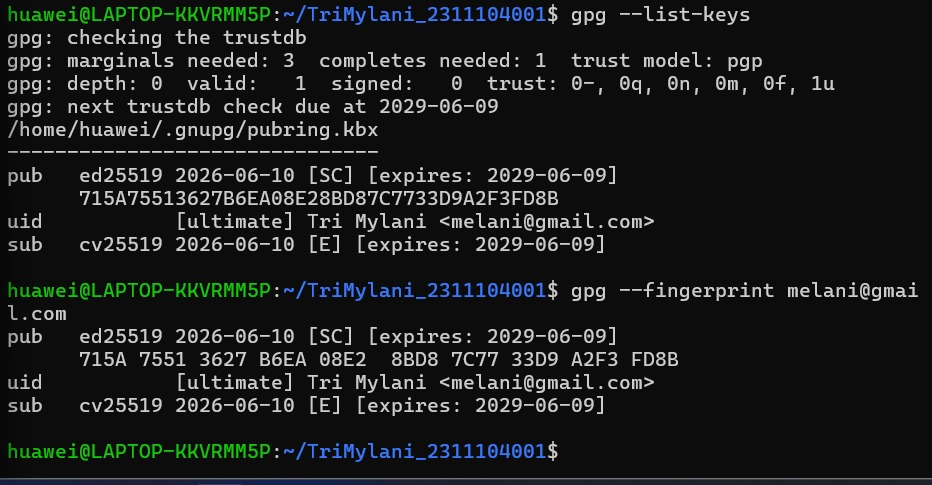

#### d.  [5 Point] Mengimport kunci publik orang lain. Silakan download file nim_teman_sebelah_anda.asc dan jalankan perintah ini untuk mengimport (menambahkan kunci publik orang lain ke sistem Anda): gpg –-import nim_teman_sebelah_anda.asc Contoh: “gpg --import 130118yyyy.asc” Setelah mengimport kunci publik teman Anda, Anda dapat mengirimkan pesan kepada teman Anda secara terenkripsi. Untuk memastikan bahwa kunci publik telah diimport lakukan perintah gpg –-list-keys dan nama teman Anda ada pada hasil perintah tersebut. 

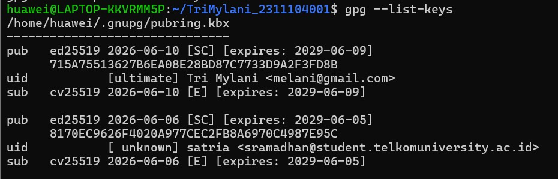

#### e. [5 Point] Enkripsi pesan. Buatlah file bernama file_rahasia.txt. Isi file tersebut dengan pesan rahasia Anda. Pesan inilah yang akan Anda kirim ke teman Anda. Jalankan perintah ini untuk melakukan enkripsi://ditulis dalam satu baris gpg –-encrypt –-armor -r alamat_email_teman_anda_yang_baru_diimport@xxx.com file_rahasia.txt

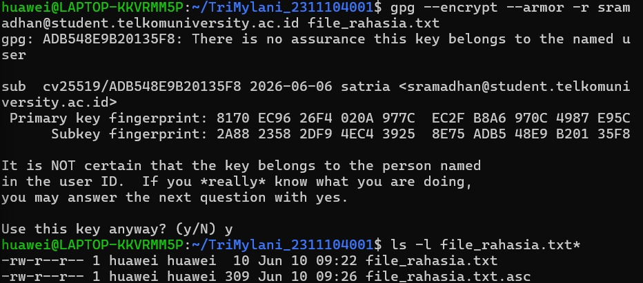

#### e. [5 Point] Hanya teman anda yang dapat membuka file tersebut. Hasil dari proses tersebut adalah file_rahasia_untuk_teman_anda.asc (contoh: file_rahasia_untuk_130118yyyy.asc) Taruh file_rahasia_untuk_teman_anda.asc ke folder pada link: http://tiny.cc/SisopNomor5F. Download dan buka file yang diperuntukkan bagi Anda dan lakukan dekripsi untuk melihat isi pesan dengan perintah: gpg file_rahasia_nim_anda.asc

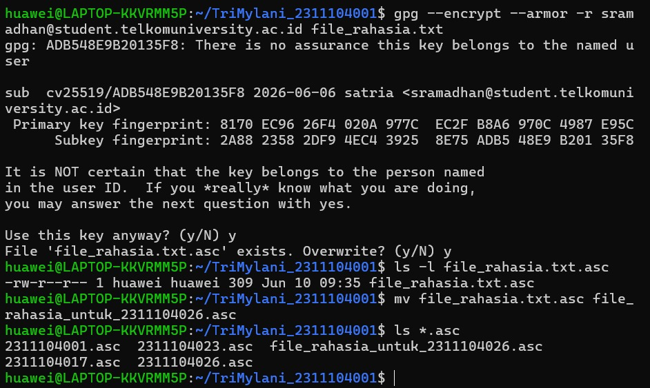

## Referensi
1. Xinu Project. (2024). Embedded Xinu Documentation. Diakses dari: https://xinu.cs.purdue.edu
2. Oracle VM VirtualBox Documentation. Oracle Corporation. https://www.virtualbox.org
3. Sourcetrail Documentation. Coati Software. https://www.sourcetrail.com
