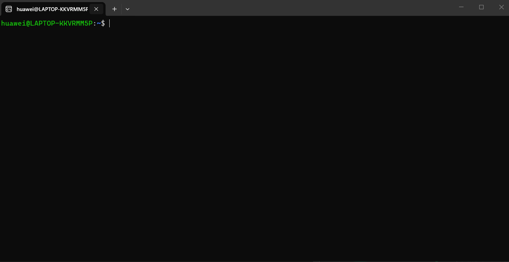

# <h1 align="center">Laporan Praktikum Modul 14  Scripting</h1>

Tri Mylani - 2311104001

## Dasar Teori
    Keamanan Linux merupakan serangkaian mekanisme dan teknik yang digunakan untuk melindungi sistem, data, serta pengguna dari berbagai ancaman seperti akses tidak sah, pencurian data, dan kerusakan sistem. Linux memiliki sistem keamanan yang kuat melalui pengaturan hak akses file dan direktori, manajemen pengguna, serta penggunaan berbagai alat keamanan yang tersedia secara bawaan. Salah satu aspek penting dalam keamanan Linux adalah menjaga integritas data menggunakan fungsi hash seperti MD5, SHA256, dan SHA512. Fungsi hash menghasilkan nilai unik yang dapat digunakan untuk memverifikasi apakah suatu file telah mengalami perubahan. Perubahan sekecil apa pun pada isi file akan menghasilkan nilai hash yang berbeda, yang dikenal sebagai efek avalanche (avalanche effect).

    Selain menjaga integritas data, Linux juga menyediakan mekanisme untuk menjaga kerahasiaan informasi melalui teknologi enkripsi. Salah satu contohnya adalah penggunaan EncFS untuk mengenkripsi folder sehingga isi file hanya dapat diakses melalui direktori yang telah didekripsi. Linux juga mendukung penggunaan GNU Privacy Guard (GPG) untuk membuat pasangan kunci publik dan privat yang digunakan dalam proses enkripsi dan dekripsi pesan. Dengan memanfaatkan kunci publik, pengguna dapat mengirim pesan yang hanya dapat dibuka oleh pemilik kunci privat yang sesuai. Melalui kombinasi hashing, enkripsi, dan pengaturan hak akses yang baik, Linux mampu memberikan tingkat keamanan yang tinggi dalam menjaga kerahasiaan, integritas, dan ketersediaan data.

## Guided
    1. Windows PowerShell dijalankan dengan hak akses Administrator.
    2. Fitur Windows Subsystem for Linux (WSL) berhasil diaktifkan pada sistem Windows.
    3. Perintah wsl --install Ubuntu dijalankan untuk mengunduh dan menginstal distribusi Ubuntu.
    4. Sistem berhasil mengunduh paket Ubuntu dari server Microsoft.
    5. Proses instalasi Ubuntu pada WSL berhasil diselesaikan tanpa kendala.
    6. Ubuntu berhasil dijalankan pertama kali melalui PowerShell menggunakan WSL.
    7. Pengguna diminta membuat akun Linux berupa username dan password.
    8. Username dan password berhasil dikonfigurasi sebagai akun utama Ubuntu.
    9. Sistem Ubuntu berhasil masuk ke terminal Linux dan siap digunakan.
    10. Perintah wsl --status menunjukkan bahwa WSL versi 2 aktif sebagai versi default.
    11.  wsl -l -v berhasil menampilkan distribusi Ubuntu yang telah terinstal.
    12. Direktori kerja praktikum berhasil dibuat pada folder home Ubuntu.
    13. Ubuntu yang berjalan melalui WSL dapat digunakan untuk menjalankan perintah-perintah Linux tanpa perlu melakukan instalasi dual boot atau virtual machine.
    14. Integrasi antara Windows dan Ubuntu melalui WSL memungkinkan akses file serta pengelolaan sistem Linux secara lebih mudah.
    15. Instalasi Ubuntu melalui PowerShell berhasil dilakukan dan sistem siap digunakan untuk kegiatan praktikum keamanan Linux.

## Referensi

1. Xinu Project. (2024). Embedded Xinu Documentation. Diakses dari: https://xinu.cs.purdue.edu
2. Oracle VM VirtualBox Documentation. Oracle Corporation. https://www.virtualbox.org
3. Sourcetrail Documentation. Coati Software. https://www.sourcetrail.com
